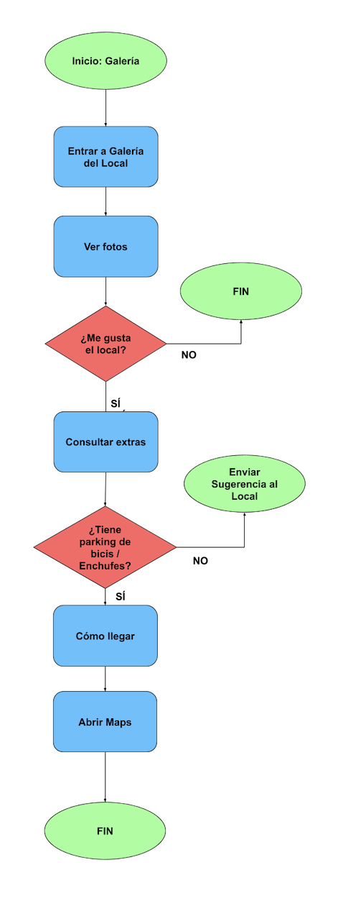
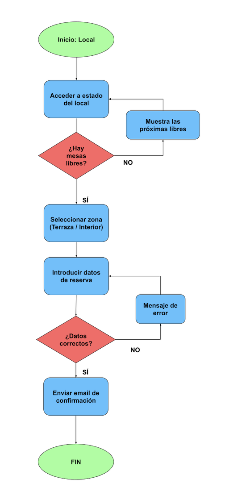
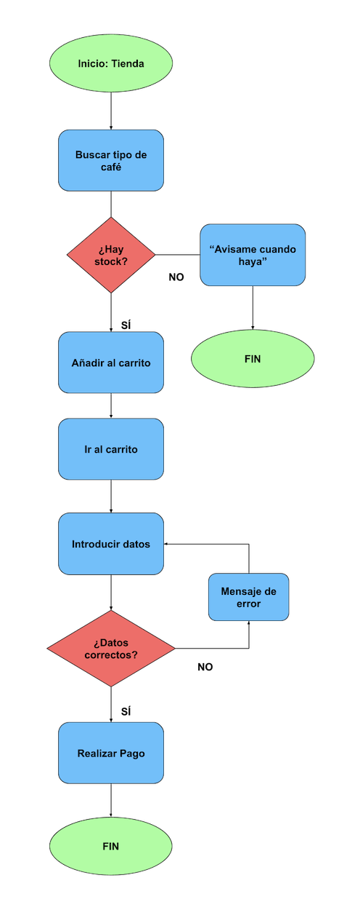

## DIU - Practica2, entregables  
## Paso 2. UX Design  

### 2.a Reframing / IDEACION: Feedback Capture Grid / EMpathy map 
 
----

Tras el análisis de la competencia, hemos utilizado el Feedback Capture Grid para sintetizar los hallazgos y convertirlos en soluciones de diseño. En esta matriz no solo abordamos fallos de usabilidad críticos como la lentitud en el checkout o la falta de buscador, sino que redefinimos nuestra propuesta para conectar con las necesidades de Luis (productividad), Laura (pazy amigos) y el público deportista (nutrición y seguridad).

Para lograrlo, priorizamos la transparencia visual mediante una galería detallada del local y un sistema de aforo en tiempo real, eliminando la incertidumbre sobre el espacio físico. Además, nos diferenciamos de la competencia ofreciendo servicios de valor añadido como soporte para bicicletas y opciones de suplementación proteica, transformando la web en el centro logístico y emocional de una experiencia barista completa y adaptada a la ciudad.  
  
 

### 2.b ScopeCanvas

----

Tras elegir nuestra identidad de marca, **"Graná en Grano"**, hemos desarrollado este Scope Canvas para alinear los objetivos de negocio con las necesidades reales de nuestros usuarios.

El propósito central de nuestra plataforma es eliminar la brecha entre la tienda online y la experiencia física en el local. Para ello, el canvas establece metas claras: desde la optimización del proceso de compra hasta la creación de una comunidad para deportistas y estudiantes. Este mapa estratégico nos permite asegurar que funcionalidades como el buscador de productos, la galería inmersiva y el indicador de aforo no sean solo añadidos técnicos, sino soluciones directas a los "dolores" de nuestros perfiles (Luis, Laura y el público ciclista), garantizando el éxito y la escalabilidad del proyecto en la ciudad.

 

### 2.b User Flow (task) analysis 
 
-----  

Para estructurar la arquitectura de la web y priorizar las funcionalidades críticas de **Graná en Grano**, hemos elaborado esta matriz de tareas. Hemos clasificado las acciones más relevantes para nuestros tres grupos principales de usuarios: el **Cliente Presencial** (estudiantes y creativos), el **Cliente Online** (compradores de café de especialidad) y el **Administrador** (gestión del local).

Siguiendo la metodología UX, hemos asignado prioridades: **Alta (H)**, **Media (M)** y **Baja (L)**.

| Tareas de Usuario | Cliente Presencial | Cliente Online | Administrador |
| :--- | :---: | :---: | :---: |
| **Consultar ubicación y cómo llegar** | H | L | L |
| **Verificar servicios (Wi-fi, enchufes, parking bicis)** | H | L | M |
| **Consultar aforo en tiempo real** | H | L | H |
| **Ver fotos del interior (Galería)** | H | M | M |
| **Consultar carta de consumición local** | H | M | H |
| **Buscar productos (Grano, suplementos)** | M | H | H |
| **Añadir al carrito y realizar el pago** | L | H | H |
| **Gestionar suscripciones de café** | L | H | H |
| **Consultar dudas y FAQs** | H | H | H |
| **Dejar reseñas sobre el local o producto** | H | H | M |
| **Gestión de pedidos y stock** | L | L | H |

  
Para cerrar el análisis de tareas, hemos seleccionado los tres flujos que definen la experiencia diferenciadora de **Graná en Grano**. El primero asegura una **conversión de venta fluida** (corrigiendo los errores vistos en la competencia); el segundo gestiona **la productividad y el aforo** (clave para nuestro usuario Luis); y el tercero garantiza la **transparencia sobre el local y sus servicios** (fundamental para ciclistas y usuarios que buscan un ambiente específico).  
 
#### 1. Flujo de Compra de Café (Usuario Online)  
Este flujo resuelve la necesidad de compra de café de especialidad y suplementos proteicos, optimizando el checkout que criticamos en la competencia.  
 

#### 2. Flujo de Consulta de Aforo y Reserva de Puesto
Este es vuestro gran elemento diferenciador: permite al cliente asegurar que tendrá un enchufe antes de ir.  
 
  
#### 3. Flujo de Verificación de Servicios y Ruta
Este flujo ayuda a decidir a los ciclistas si el local es seguro para sus bicis y al cliente si el ambiente es el que busca.  
 
  

### 2.c IA: Sitemap + Labelling 
 
----

>>> Identificar términos para diálogo con usuario (evita el spanglish) y la arquitectura de la información. Es muy apropiado un diagrama tipo sitemap y una tabla que se ampliaría para llevar asociado la columna iconos (tanto para la web como para una app). 

Término | Significado     
| ------------- | -------
  Login  | acceder a plataforma

### 2.d Wireframes
 
-----

>>> Plantear el diseño del layout para Web/movil (organización y simulación). Describa la herramienta usada
>>> HOMEPAGE

>>> NUESTRO ESPACIO

>>> RESULTADO BUSQUEDA
 
  
 

### Conclusiones  
(incluye valoración de esta etapa)

>>>> Este fichero se debe editar para que cada evidencia quede enlazada con el recurso subido a la carpeta de la practica. Se pide más detalle técnico en las descripciones de lo que sería el README principal del repositorio y que corresponde a la descripcion del Case Study.
>>>> Termine con la seccion de Conclusiones para aportar una valoración final del equipo sobre la propia realización de la práctica
