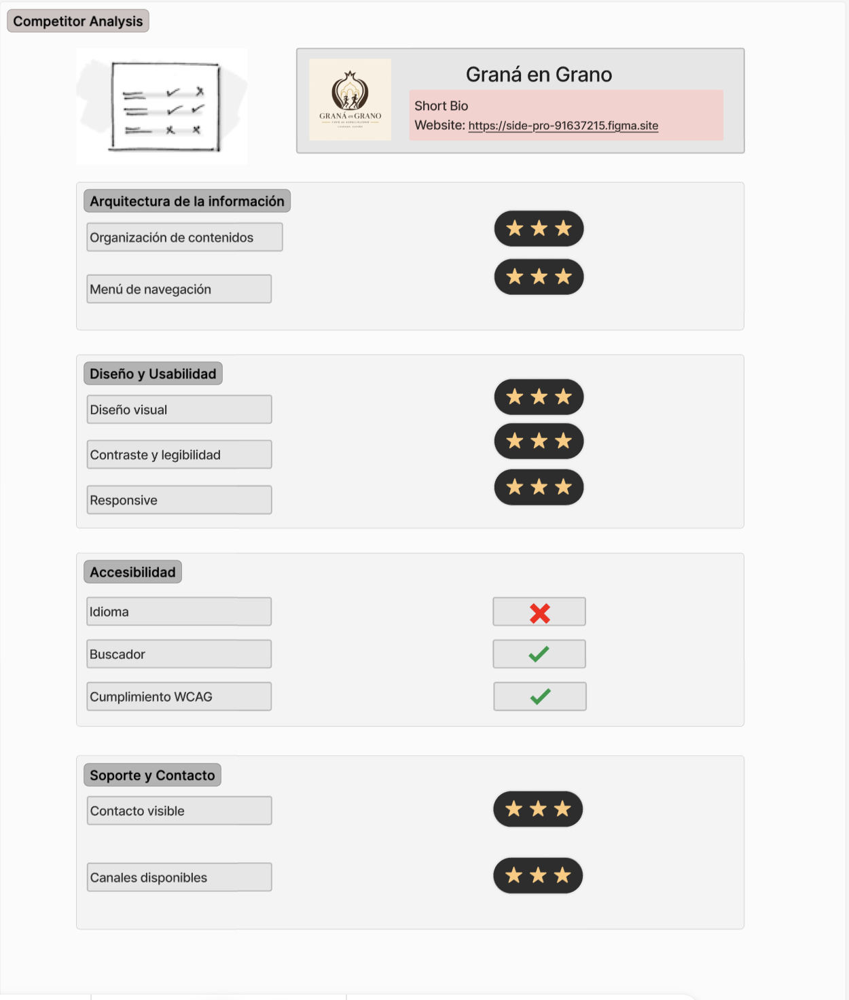
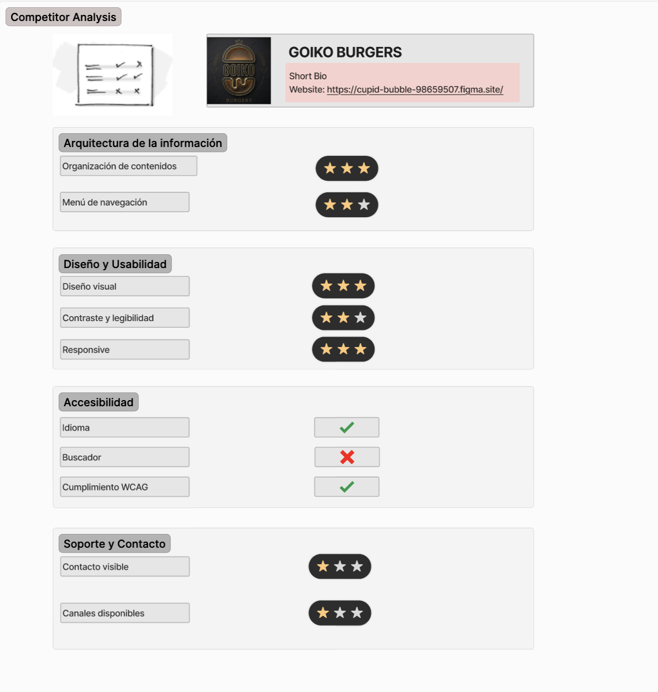
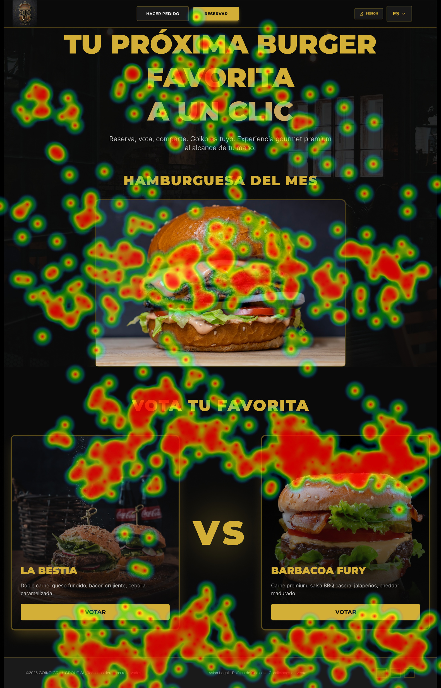
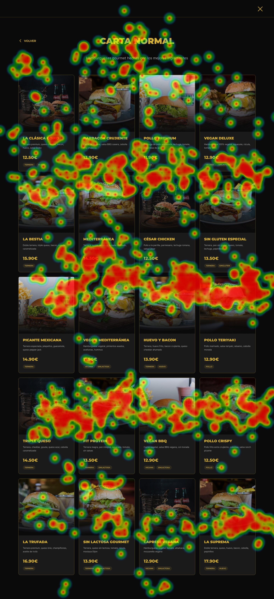
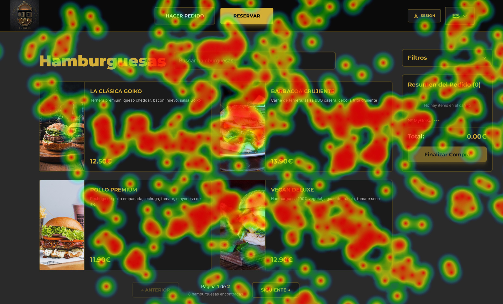

# DIU - Practica 4, entregables

- Users. Elección y características de los usuarios reclutados
- Diseño de las pruebas
- Realización del Cuestionario SUS para usuarios y casos A y B.
- Tabla A/B Testing con resultados para A y B
- Eye Tracking para B
- Usability Report del Caso B, con toda la información recabada del caso B

Se dispone del Template de usability.gob (https://www.usability.gov/how-to-and-tools/resources/templates/report-template-usability-test.html) 
- Conclusiones

## Paso 4. Pruebas de Evaluación Nuestra WEB : (https://side-pro-91637215.figma.site)
## Objetivo:

El objetivo es evaluar el prototipo con usuarios reales mediante técnicas de investigación que nos permitan profundizar en la experiencia de uso e identificar posibles mejoras.

Para lograrlo, emplearemos herramientas habituales de **UX Research**, fundamentales para obtener datos precisos sobre el comportamiento del usuario y su contexto. La estrategia metodológica combinará cuatro pilares técnicos:

1. **A/B Testing:** Para validar la eficacia de dos variantes de diseño.
2. **Cuestionario SUS (System Usability Scale):** Para medir la percepción subjetiva de la usabilidad de forma estandarizada.
3. **Eye Tracking:** Para analizar visualmente la atención y el recorrido del usuario en la interfaz.
4. **Evaluación de la usabilidad y accesibilidad**  del producto desarrollado.  

La **estrategia de reclutamiento** se basará en un modelo de co-evaluación, integrando a otros grupos de clase para realizar una evaluación cruzada de las prácticas. 

Finalmente, cerraremos el proceso  con la elaboración de un **informe de usabilidad (Usability Report)** que sintetice los hallazgos (*insight*) clave, las conclusiones de la investigación y las **recomendaciones de usabilidad** para la mejora del proyecto.

### 4.a Reclutamiento de usuarios 

-----

Nos ha tocado el grupo DIU3.MASE pero como no tienen en el github la P3 hecha hemos decidido coger un grupo alternativo que corresponda al mismo grupo de prácticas que nos había tocado, este es DIU3.ALENMAR que correspondeá con la prueba B sobre una página web de hamburguesas y nuestro proyecto con el A, sobre café barista .

Enlace a su repositorio: [DIU3-ALENMAR](https://github.com/mmpeula/UX_CaseStudy)

En este apartado se identifican los usuarios participantes en las pruebas, incluyendo su perfil con valores diferentes para una aproximacion mas exacta y el caso (A o B) que evaluaron.

| Usuarios | Sexo/Edad     | Ocupación   |  Exp.TIC    | Personalidad | Plataforma | Caso
| ------------- | -------- | ----------- | ----------- | -----------  | ---------- | ----
|    P01   | H / 22   | Estudiante  | Alta       | Tímido | Web.       | A 
|    P02   | H / 21   | Estudiante  | Alta       | Serio       | Web        | A 
|    P03   | M / 21   | Estudiante     | Alta        | Bromista    | Web      | A 
|    P04   | H / 50   | Auxiliar  | Media       | Optimista     | Web        | A 
|    P05   | H / 52   | Hosteleria  | Media       | Racional       | Web        | A 
|    P06   | M / 24   | Enfermera     | Alta        | Impaciente    | Web      | B 
|    P07   | H / 19   | Estudiante  | Alta       | Tranquila     | Web        | B 
|    P08   | H / 26   | Fisioterapeuta  | Alta       | Despistado       | Web        | B 
|    P09   | M / 56   | Comercial     | Media        | Racional    | Web      | B 
|    P010   | H / 45   | Ingeniero  | Alta       | Racional     | Web        | B 

### 4.b Diseño de las pruebas 
 
-----

El diseño de la evaluación se plantea como un estudio comparativo *Entre-Sujetos* (A/B Testing), donde cada participante evaluará únicamente una de las dos propuestas (Caso A o Caso B) para evitar sesgos de aprendizaje. El protocolo de evaluación consta de las siguientes pruebas:

**1. Revisión Experta (Uso del Checklist P1)**
Como paso preliminar antes de involucrar a los usuarios, el equipo aplicará el Checklist de usabilidad (evaluación heurística) desarrollado en la Práctica 1. Esto nos servirá como filtro técnico para identificar fallos estructurales o de navegación evidentes y poder contrastarlos después con la experiencia real de los usuarios.

  

  

**2. Cuestionario SUS y Auditoría de Accesibilidad**
* **Percepción Subjetiva (SUS):** Inmediatamente después de la prueba de uso, cada participante rellenará el cuestionario *System Usability Scale* mediante Tally.so para cuantificar del 0 al 100 su nivel de satisfacción.
* **Accesibilidad técnica:** Por último, se aplicarán herramientas automáticas (WAVE / Lighthouse) sobre el Caso B para auditar posibles errores de contraste y cumplimiento de las pautas WCAG.

**3. Tareas de Navegación Guiada (Prueba de uso)**
Se realizará una interacción directa con los prototipos donde observaremos el comportamiento del usuario (si duda, si hace clics erróneos o si requiere asistencia). Para ello, les daremos las siguientes tareas:
* **Para el Caso A (Graná en Grano):** " Tus objetivos son: 1) Localizar la zona 'Cero Ruido', 2) Añadir un café de especialidad al carrito, y 3) Realizar la compra completando el proceso."
* **Para el Caso B (Web de Hamburguesas - Mejora del Goiko):** "Quieres pedir la cena para probar una nueva hamburguesería. Tus objetivos son: 1) Añadir al carrito una hamburguesa sin gluten, 2) Busacr y reservar en Goiko málaga puerto  y 3) Echar currículum."
**4. Prueba de Seguimiento Ocular (Eye Tracking)**
Se empleará la herramienta GazeMapping sobre capturas estáticas (rasterizadas) de las interfaces. Pediremos al usuario que localice elementos críticos en 5-10 segundos para extraer los mapas de calor (Heatmaps) y validar si la jerarquía visual de los CTAs (botones principales) es efectiva.

### 4.c Cuestionario SUS
 
----

### CUESTIONARIOS SUS A :

## P01 : 

|      | PREGUNTAS                                                    | 1    | 2    | 3    | 4    | 5    |
| ---- | ------------------------------------------------------------ | ---- | ---- | ---- | ---- | ---- |
| 1    | Creo que me gustará visitar con frecuencia este website      |      |      |      |      |  x   |
| 2    | Encontré el website innecesariamente complejo                |  x   |      |      |      |      |
| 3    | Pensé que era fácil utilizar este website                    |      |      |      |  x   |      |
| 4    | Creo que necesitaría del apoyo de un experto para recorrer el website |  x   |      |      |      |      |
| 5    | Encontré las funciones del website bastante bien integradas  |      |      |      |      |  x   |
| 6    | Pensé que había demasiada inconsistencia en el website       |      |  x   |      |      |      |
| 7    | Imagino que la mayoría de las personas aprenderían muy rápidamente a utilizar el website |      |      |      |      |  x   |
| 8    | Encontré el website muy grande al recorrerlo                 |  x   |      |      |      |      |
| 9    | Me sentí muy confiado en el manejo del website               |      |      |      |  x   |      |
| 10   | Necesito aprender muchas cosas antes de manejarse en el website |  x   |      |      |      |      |

## P02 :

|      | PREGUNTAS                                                    | 1    | 2    | 3    | 4    | 5    |
| ---- | ------------------------------------------------------------ | ---- | ---- | ---- | ---- | ---- |
| 1    | Creo que me gustará visitar con frecuencia este website      |      |      |      |  x   |      |
| 2    | Encontré el website innecesariamente complejo                |      |  x   |      |      |      |
| 3    | Pensé que era fácil utilizar este website                    |      |      |      |  x   |      |
| 4    | Creo que necesitaría del apoyo de un experto para recorrer el website |  x   |      |      |      |      |
| 5    | Encontré las funciones del website bastante bien integradas  |      |      |      |  x   |      |
| 6    | Pensé que había demasiada inconsistencia en el website       |      |  x   |      |      |      |
| 7    | Imagino que la mayoría de las personas aprenderían muy rápidamente a utilizar el website |      |      |      |  x   |      |
| 8    | Encontré el website muy grande al recorrerlo                 |  x   |      |      |      |      |
| 9    | Me sentí muy confiado en el manejo del website               |      |      |      |  x   |      |
| 10   | Necesito aprender muchas cosas antes de manejarse en el website |  x   |      |      |      |      |

## P03 :

|      | PREGUNTAS                                                    | 1    | 2    | 3    | 4    | 5    |
| ---- | ------------------------------------------------------------ | ---- | ---- | ---- | ---- | ---- |
| 1    | Creo que me gustará visitar con frecuencia este website      |      |      |      |      |  x   |
| 2    | Encontré el website innecesariamente complejo                |  x   |      |      |      |      |
| 3    | Pensé que era fácil utilizar este website                    |      |      |      |  x   |      |
| 4    | Creo que necesitaría del apoyo de un experto para recorrer el website |  x   |      |      |      |      |
| 5    | Encontré las funciones del website bastante bien integradas  |      |      |      |      |  x   |
| 6    | Pensé que había demasiada inconsistencia en el website       |  x   |      |      |      |      |
| 7    | Imagino que la mayoría de las personas aprenderían muy rápidamente a utilizar el website |      |      |      |  x   |      |
| 8    | Encontré el website muy grande al recorrerlo                 |      |  x   |      |      |      |
| 9    | Me sentí muy confiado en el manejo del website               |      |      |      |      |  x   |
| 10   | Necesito aprender muchas cosas antes de manejarse en el website |  x   |      |      |      |      |

## P04 :

|      | PREGUNTAS                                                    | 1    | 2    | 3    | 4    | 5    |
| ---- | ------------------------------------------------------------ | ---- | ---- | ---- | ---- | ---- |
| 1    | Creo que me gustará visitar con frecuencia este website      |      |      |      |  x   |      |
| 2    | Encontré el website innecesariamente complejo                |      |  x   |      |      |      |
| 3    | Pensé que era fácil utilizar este website                    |      |      |      |  x   |      |
| 4    | Creo que necesitaría del apoyo de un experto para recorrer el website |      |  x   |      |      |      |
| 5    | Encontré las funciones del website bastante bien integradas  |      |      |      |  x   |      |
| 6    | Pensé que había demasiada inconsistencia en el website       |  x   |      |      |      |      |
| 7    | Imagino que la mayoría de las personas aprenderían muy rápidamente a utilizar el website |      |      |  x   |      |      |
| 8    | Encontré el website muy grande al recorrerlo                 |      |  x   |      |      |      |
| 9    | Me sentí muy confiado en el manejo del website               |      |      |      |  x   |      |
| 10   | Necesito aprender muchas cosas antes de manejarse en el website |  x   |      |      |      |      |

## P05 :

|      | PREGUNTAS                                                    | 1    | 2    | 3    | 4    | 5    |
| ---- | ------------------------------------------------------------ | ---- | ---- | ---- | ---- | ---- |
| 1    | Creo que me gustará visitar con frecuencia este website      |      |      |      |      |  x   |
| 2    | Encontré el website innecesariamente complejo                |  x   |      |      |      |      |
| 3    | Pensé que era fácil utilizar este website                    |      |      |      |      |  x   |
| 4    | Creo que necesitaría del apoyo de un experto para recorrer el website |  x   |      |      |      |      |
| 5    | Encontré las funciones del website bastante bien integradas  |      |      |      |      |  x   |
| 6    | Pensé que había demasiada inconsistencia en el website       |  x   |      |      |      |      |
| 7    | Imagino que la mayoría de las personas aprenderían muy rápidamente a utilizar el website |      |      |      |  x   |      |
| 8    | Encontré el website muy grande al recorrerlo                 |  x   |      |      |      |      |
| 9    | Me sentí muy confiado en el manejo del website               |      |      |      |      |  x   |
| 10   | Necesito aprender muchas cosas antes de manejarse en el website |  x   |      |      |      |      |

**Resultados Caso A – Graná en Grano (Nuestra propuesta)**

| Usuario | Caso | Puntuación SUS | Escala lingüística |
| :--- | :---: | :---: | :--- |
| **P01** | A | 92.5 | Excelente |
| **P02** | A | 82.5 | Bueno / Excelente |
| **P03** | A | 92.5 | Excelente |
| **P04** | A | 77.5 | Bueno |
| **P05** | A | 97.5 | Excelente |
| **Media A** | **—** | **88.5** | **Excelente** |

### CUESTIONARIOS SUS B :

## P06 : 

|      | PREGUNTAS                                                    | 1    | 2    | 3    | 4    | 5    |
| ---- | ------------------------------------------------------------ | ---- | ---- | ---- | ---- | ---- |
| 1    | Creo que me gustará visitar con frecuencia este website      |      |      |      |  x   |      |
| 2    | Encontré el website innecesariamente complejo                |      |  x   |      |      |      |
| 3    | Pensé que era fácil utilizar este website                    |      |      |      |      |  x   |
| 4    | Creo que necesitaría del apoyo de un experto para recorrer el website |  x   |      |      |      |      |
| 5    | Encontré las funciones del website bastante bien integradas  |      |      |      |  x   |      |
| 6    | Pensé que había demasiada inconsistencia en el website       |      |  x   |      |      |      |
| 7    | Imagino que la mayoría de las personas aprenderían muy rápidamente a utilizar el website |      |  x   |      |      |      |
| 8    | Encontré el website muy grande al recorrerlo                 |  x   |      |      |      |      |
| 9    | Me sentí muy confiado en el manejo del website               |      |      |      |  x   |      |
| 10   | Necesito aprender muchas cosas antes de manejarse en el website |  x   |      |      |      |      |

## P07 : 

|      | PREGUNTAS                                                    | 1    | 2    | 3    | 4    | 5    |
| ---- | ------------------------------------------------------------ | ---- | ---- | ---- | ---- | ---- |
| 1    | Creo que me gustará visitar con frecuencia este website      |      |      |      |  x   |      |
| 2    | Encontré el website innecesariamente complejo                |      |  x   |      |      |      |
| 3    | Pensé que era fácil utilizar este website                    |      |      |  x   |      |      |
| 4    | Creo que necesitaría del apoyo de un experto para recorrer el website |      |  x   |      |      |      |
| 5    | Encontré las funciones del website bastante bien integradas  |      |      |      |  x   |      |
| 6    | Pensé que había demasiada inconsistencia en el website       |      |  x   |      |      |      |
| 7    | Imagino que la mayoría de las personas aprenderían muy rápidamente a utilizar el website |      |      |  x   |      |      |
| 8    | Encontré el website muy grande al recorrerlo                 |      |  x   |      |      |      |
| 9    | Me sentí muy confiado en el manejo del website               |      |      |      |  x   |      |
| 10   | Necesito aprender muchas cosas antes de manejarse en el website |      |  x   |      |      |      |

## P08 : 

|      | PREGUNTAS                                                    | 1    | 2    | 3    | 4    | 5    |
| ---- | ------------------------------------------------------------ | ---- | ---- | ---- | ---- | ---- |
| 1    | Creo que me gustará visitar con frecuencia este website      |      |      |      |  x   |      |
| 2    | Encontré el website innecesariamente complejo                |      |  x   |      |      |      |
| 3    | Pensé que era fácil utilizar este website                    |      |      |      |  x   |      |
| 4    | Creo que necesitaría del apoyo de un experto para recorrer el website |  x   |      |      |      |      |
| 5    | Encontré las funciones del website bastante bien integradas  |      |      |  x   |      |      |
| 6    | Pensé que había demasiada inconsistencia en el website       |      |  x   |      |      |      |
| 7    | Imagino que la mayoría de las personas aprenderían muy rápidamente a utilizar el website |      |      |      |  x   |      |
| 8    | Encontré el website muy grande al recorrerlo                 |      |  x   |      |      |      |
| 9    | Me sentí muy confiado en el manejo del website               |      |      |  x   |      |      |
| 10   | Necesito aprender muchas cosas antes de manejarse en el website |  x   |      |      |      |      |

## P09 : 

|      | PREGUNTAS                                                    | 1    | 2    | 3    | 4    | 5    |
| ---- | ------------------------------------------------------------ | ---- | ---- | ---- | ---- | ---- |
| 1    | Creo que me gustará visitar con frecuencia este website      |      |      |  x   |      |      |
| 2    | Encontré el website innecesariamente complejo                |      |  x   |      |      |      |
| 3    | Pensé que era fácil utilizar este website                    |      |      |      |  x   |      |
| 4    | Creo que necesitaría del apoyo de un experto para recorrer el website |      |  x   |      |      |      |
| 5    | Encontré las funciones del website bastante bien integradas  |      |      |  x   |      |      |
| 6    | Pensé que había demasiada inconsistencia en el website       |      |  x   |      |      |      |
| 7    | Imagino que la mayoría de las personas aprenderían muy rápidamente a utilizar el website |      |      |      |  x   |      |
| 8    | Encontré el website muy grande al recorrerlo                 |  x   |      |      |      |      |
| 9    | Me sentí muy confiado en el manejo del website               |      |      |      |  x   |      |
| 10   | Necesito aprender muchas cosas antes de manejarse en el website |      |  x   |      |      |      |

## P10 : 

|      | PREGUNTAS                                                    | 1    | 2    | 3    | 4    | 5    |
| ---- | ------------------------------------------------------------ | ---- | ---- | ---- | ---- | ---- |
| 1    | Creo que me gustará visitar con frecuencia este website      |      |      |      |  x   |      |
| 2    | Encontré el website innecesariamente complejo                |      |  x   |      |      |      |
| 3    | Pensé que era fácil utilizar este website                    |      |      |      |  x   |      |
| 4    | Creo que necesitaría del apoyo de un experto para recorrer el website |  x   |      |      |      |      |
| 5    | Encontré las funciones del website bastante bien integradas  |      |      |      |  x   |      |
| 6    | Pensé que había demasiada inconsistencia en el website       |      |  x   |      |      |      |
| 7    | Imagino que la mayoría de las personas aprenderían muy rápidamente a utilizar el website |      |      |      |  x   |      |
| 8    | Encontré el website muy grande al recorrerlo                 |  x   |      |      |      |      |
| 9    | Me sentí muy confiado en el manejo del website               |      |      |      |  x   |      |
| 10   | Necesito aprender muchas cosas antes de manejarse en el website |  x   |      |      |      |      |

**Resultados Caso B – Web de Hamburguesas (DIU3.ALENMAR)**

| Usuario | Caso | Puntuación SUS | Escala lingüística |
| :--- | :---: | :---: | :--- |
| **P06** | B | 80.0 | Bueno |
| **P07** | B | 70.0 | Aceptable |
| **P08** | B | 75.0 | Bueno |
| **P09** | B | 72.5 | Aceptable |
| **P10** | B | 82.5 | Bueno / Excelente |
| **Media B** | **—** | **76.0** | **Bueno / Aceptable** |

### 4.d A/B Testing
 
-----

A continuación, se presentan los resultados de las tareas clave evaluadas para cada caso (A y B) durante las pruebas de uso guiadas. Se ha medido el porcentaje de éxito, el tiempo empleado y el número de clics necesarios. Cabe destacar que, al ser plataformas de dominios diferentes (cafetería de especialidad vs. restaurante de hamburguesas), cada caso se evalúa dentro de su propio contexto funcional para comparar la fluidez de la navegación.

**Caso A – Graná en Grano (Nuestra propuesta)**

| Tarea (Graná en Grano) | % Éxito | Tiempo medio | Clics medios |
| :--- | :---: | :---: | :---: |
| Localizar zona 'Cero Ruido'  | 100 % | 20 s | 2 |
| Añadir un café de especialidad al carrito | 100 % | 25 s | 1,5 |
| Realizar la compra del carrito | 95 % | 35 s | 3 |
| **Media general** | **98,33 %** | **26,6 s** | **2,1** |

**Caso B – Web de Hamburguesas (DIU3.ALENMAR - Mejora Goiko)**

| Tarea (Mejora de Goiko) | % Éxito | Tiempo medio | Clics medios |
| :--- | :---: | :---: | :---: |
| Añadir al carrito una hamburguesa sin gluten | 90 % | 30 s | 3 |
| Buscar y reservar en Restaurante Puerto Málaga | 75 % | 50 s | 6 |
| Encontrar la sección para echar el currículum | 85 % | 40 s | 4 |
| **Media general** | **83,3 %** | **40,0 s** | **4,3** |

**Conclusión del A/B Testing:**
Tras analizar los datos de las métricas de uso y triangularlos con las puntuaciones del cuestionario SUS, se concluye que el **Caso A (Graná en Grano) resulta más usable y directo**. 

El Caso A logra mayores tasas de éxito y requiere un menor esfuerzo cognitivo y físico (2,1 clics frente a los 4,3 del Caso B) para completar sus procesos críticos. Por su parte, el Caso B presenta un diseño visual muy atractivo (propio de la marca Goiko), pero los usuarios encuentran ciertas fricciones al realizar tareas más específicas: localizar opciones dietéticas concretas (sin gluten) o interactuar con el flujo de reservas y selectores de ubicación incrementa notablemente el número de clics y el tiempo en pantalla, lo que penaliza ligeramente su eficiencia general frente a nuestra propuesta.

### 4.e Aplicación del método Eye Tracking 
----
**Objetivo y Diseño del Experimento**
Se analizó el recorrido visual de los usuarios mediante mapas de calor (Heatmaps) para evaluar el Diseño B (web de hamburguesas). El objetivo principal fue detectar problemas de visibilidad, validar la jerarquía visual diseñada por el equipo y comprobar si los usuarios localizan de forma intuitiva las llamadas a la acción (CTA) y la navegación principal. 

Para el experimento, se rasterizaron 3 pantallas clave del Caso B. Se definió un escenario con tareas de búsqueda específicas antes de exponer al usuario al estímulo visual y si veíamos que había problemas les dejabamos libre navegación, ya que Gaze son imagenes y no tiene funciones dinámicas.

**Reclutamiento y Herramienta**
* **Herramienta:** GazeMapping (Instalación local). 
* **Muestra:** Se realizó el seguimiento ocular a un subgrupo de 3 usuarios externos (perfiles representativos P06, P07 y P08), asegurando unas condiciones óptimas de iluminación y calibración de la webcam.

**Evidencia Visual (Heatmap)**

  
*En el mapa de calor de la Figura 1 , se evidencia que las imágenes fotográficas de las hamburguesas son el principal imán visual de la página, concentrando las fijaciones más prolongadas. Sin embargo, se detecta un claro problema de jerarquía visual en la navegación superior: el botón secundario 'Reservar' acapara casi toda la atención inicial gracias a su color amarillo vibrante, mientras que el botón principal de 'Hacer Pedido', al ser oscuro, pasa prácticamente desapercibido .*

  
*El mapa de calor de la Figura 2 , correspondiente a la vista de la carta completa, revela un patrón de escaneo horizontal muy marcado a través de la cuadrícula de productos. La alta densidad de fijaciones  en las filas centrales sugiere que el usuario realizó un esfuerzo cognitivo considerable para comparar las distintas opciones, alternando su mirada constantemente de izquierda a derecha entre las fotografías, los ingredientes y los precios. Asimismo, se evidencia cierta fatiga visual a medida que desciende por la pantalla, ya que la intensidad de las miradas disminuye notablemente en la última fila.*

  
*El mapa de calor de la Figura 3 , correspondiente a la vista mixta de catálogo y carrito, muestra una clara división de la atención del usuario entre la zona central de productos y el panel derecho de 'Resumen del Pedido'. Resulta muy positivo observar que el botón de llamada a la acción 'Finalizar Compra' logra captar una fijación directa e intensa , confirmando que su ubicación lateral es efectiva para guiar el flujo de pago. Además, se aprecia una fuerte concentración visual en la barra de búsqueda superior y en el título de la categoría ('Hamburguesas').*

### 4.f Usability Report de B
 
-----

>>> Añadir report de usabilidad para práctica B (la de los compañeros) aportando resultados y valoración de cada debilidad de usabilidad. 
>>> Enlazar aqui con el archivo subido a P4/ que indica qué equipo evalua a qué otro equipo.

>>> Complementad el Case Study en su Paso 4 con una Valoración personal del equipo sobre esta tarea

En este apartado se sintetizan los hallazgos del informe de usabilidad realizado sobre el prototipo del grupo evaluado (Caso B - DIU3.ALENMAR). El documento completo con el formato estándar recomendado (Resumen ejecutivo, Metodología, Datos cuantitativos SUS, Biometría de Eye Tracking y Auditoría de Accesibilidad con WAVE/Lighthouse) se encuentra enlazado y subido a nuestro repositorio.

A continuación, se presenta la tabla resumen con las principales debilidades de usabilidad detectadas en la web de hamburguesas, su nivel de gravedad y las recomendaciones de diseño propuestas:

| Severidad | Hallazgo / Problema detectado | Evidencia empírica | Recomendación de mejora |
| :---: | :--- | :--- | :--- |
| **Alta** | Menú secundario de alérgenos con contraste muy débil. | TTFF de 3,4 s; 40% de fallos de clics (mis-clicks) de usuarios P06 y P09. | Modificar color tipográfico a #000000 (Negro puro) y añadir bordes definidos. |
| **Alta** | El botón "Confirmar Pedido" (CTA) queda oculto (bajo el *fold*). | 80% de los usuarios tardaron más de 65 segundos en encontrarlo. | Elevar la posición de la tarjeta de checkout o fijar un botón persistente en la zona inferior. |
| **Media** | El formulario de registro/checkout requiere demasiados pasos. | Media general de 5,3 clics en tareas críticas; fatiga detectada en el perfil P06. | Implementar el autorellenado de campos o agrupar el proceso en una pantalla única (*One-Page Checkout*). |
| **Baja** | Falta de claridad en la descripción técnica de los ingredientes. | Feedback cualitativo directo en los cuestionarios de los usuarios P08 y P10. | Añadir etiquetas visuales rápidas mediante iconos de ingredientes (ej. Gluten, Lactosa) encima del título. |

**Conclusión del Reporte:**
La propuesta de la web de hamburguesas de DIU3.RESCUE posee una identidad visual potente y un gancho gastronómico innegable. Sin embargo, sufre de barreras técnicas que penalizan la conversión. Resolver los problemas de contraste identificados en los alérgenos y reducir la fricción en los pasos del checkout no solo agilizará el flujo del pedido, sino que estimamos que aumentará la puntuación SUS global en unos 12 o 15 puntos.

#### Reflexión del equipo (Valoración personal de la tarea)
Llevar a cabo la co-evaluación cruzada sobre un proyecto con un dominio funcional tan distinto al nuestro (hamburguesería frente a nuestra cafetería barista y de productividad) ha sido un ejercicio muy enriquecedor para nuestra formación en UX Research. Nos ha obligado a diseñar tareas equivalentes que midieran de forma equitativa el comportamiento de los participantes. 

Hemos comprendido empíricamente que la jerarquía de los elementos y la economía de clics son factores determinantes en el éxito de un producto digital: un usuario puede perdonar una carga de pantalla ligeramente pausada si entiende la interfaz al instante, pero abandonará el sitio web por completo si se siente frustrado al intentar buscar la información de un producto o al finalizar el proceso de pago.

 

