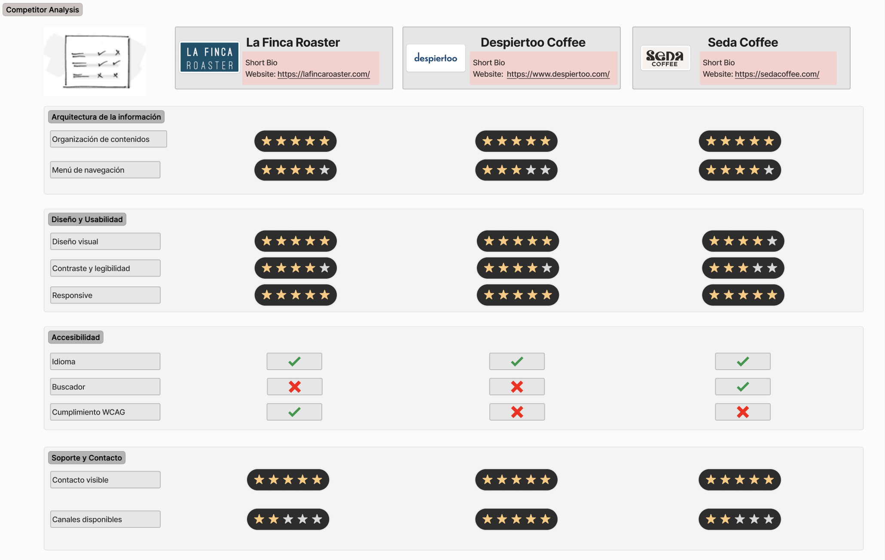
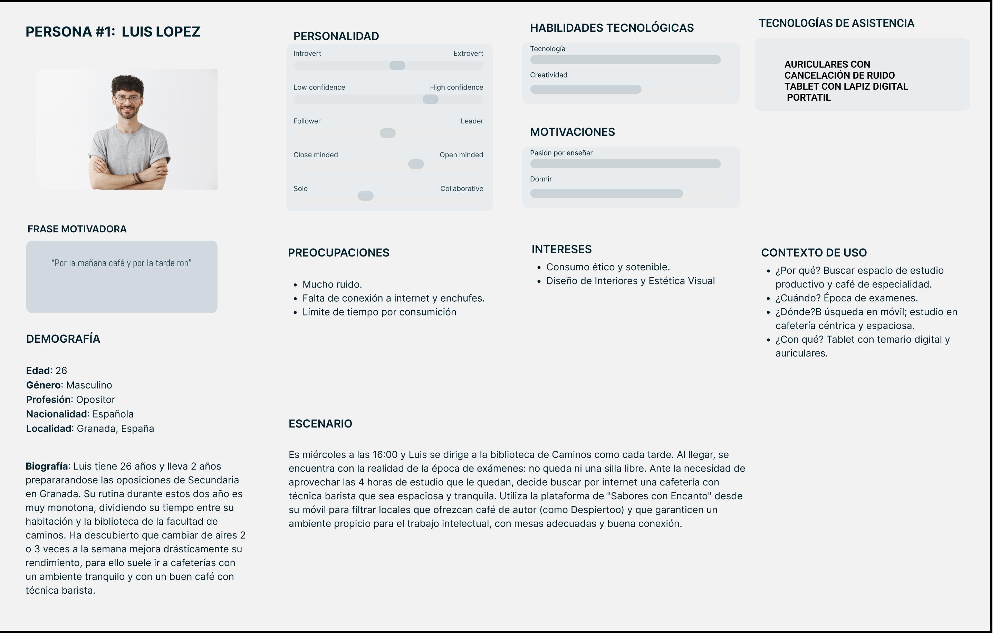
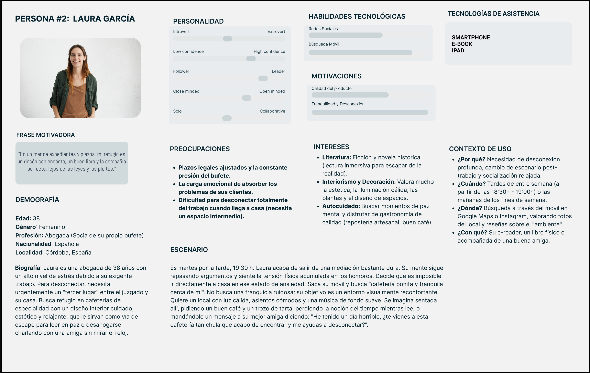
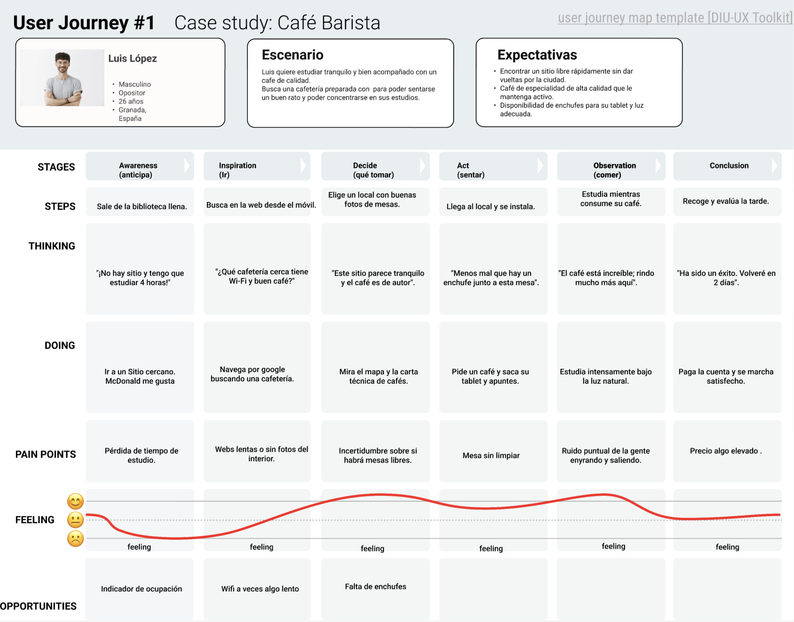
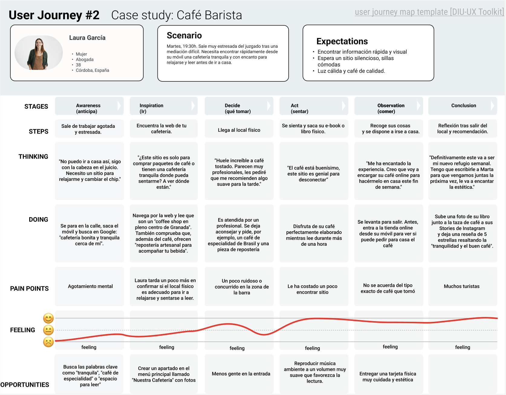
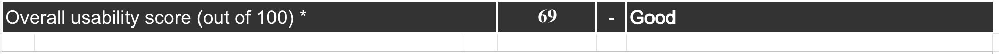
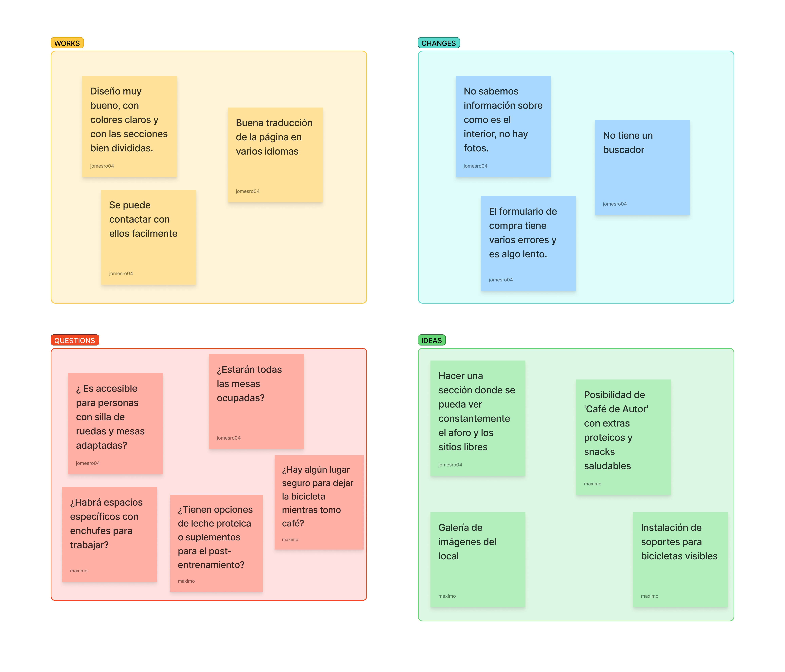

# DIU26
Prácticas Diseño Interfaces de Usuario (Tema: Cafetería y experiencia Barista ) 

* [Guiones de prácticas](GuionesPracticas/)
* [Guía para crea tu Case Study](Guia_CaseStudy.md)
* Sala de la Fama [DIU Hall of fame](https://github.com/mgea/DIU/tree/master/hall_of_fame) donde se pueden encontrar Case Study destacados de otros años.

Actualizado: 14/01/2026

## Paso 0 My UX-Case Study
 
-----

>>> Este documento es el esqueleto del Case Study que explica el proceso de desarrollo de las 5 prácticas de DIU. Aparte de subir cada entrega a PRADO, se debe actualizar y dar formato de informe final a este documento online. Elimine este tipo de texto / comentarios desde la práctica 1 conforme proceda a cada paso

>>> Hay que Publicar de forma incremental "my Case Study" en Github... Es el momento de dejar este documento para que sea evaluado y calificado como parte de la práctica
>>> Documente bien la cabecera y asegurese que ha resumido los pasos realizados para el diseño de su producto

Grupo: DIU2.JoMax.  Curso: 2025/26 

Nombre del Proyecto: 

>>> Decida el nombre corto de su propuesta en la práctica 2 

Descripción: 

>>> Describa la idea de su producto en la práctica 2 

Logotipo: 

>>> Si diseña un logotipo para su producto en la práctica 3 pongalo aqui, a un tamaño adecuado. Si diseña un slogan añadalo aquí

Miembros y nombre del equipo:
 * :bust_in_silhouette: Jose Miguel Estella Román    :octocat: https://github.com/jomesro
 * :bust_in_silhouette: Máximo Martín Moreno         :octocat: https://github.com/maximartinm

----- 

 

# Proceso de Diseño 

 

## Paso 1. UX User & Desk Research & Analisis 

### 1.a User Reseach Plan
 
-----
Actualmente, presenciamos un notable auge en el número de cafeterías de especialidad en nuestra ciudad. Nuestro proyecto consiste en diseñar y desarrollar desde cero la página web para un nuevo local de este tipo, apoyándonos en los conocimientos sobre diseño y desarrollo web adquiridos en nuestra carrera. Nuestro enfoque principal será trasladar la rica experiencia física del local —que incluye el ambiente, la maestría de los baristas y la calidad del café de autor— al entorno digital. Para lograrlo, primero investigaremos en profundidad el mercado y a los distintos tipos de usuarios que frecuentan estas cafeterías (como estudiantes, trabajadores en remoto y entusiastas del café), con el objetivo de comprender sus motivaciones y ofrecerles la mejor experiencia posible.  

Dado que frecuentamos mucho este tipo de locales, combinaremos nuestra propia experiencia observacional con métodos de investigación ágiles. Esta inmersión nos permitirá identificar áreas de mejora respecto a los servicios actuales, ayudándonos a definir estrategias para diferenciarnos y captar a un público más amplio.  

Posteriormente, llevaremos a cabo un análisis competitivo centrado en cómo diseñan sus páginas web nuestros competidores directos. Evaluaremos su usabilidad y contenido para identificar sus puntos débiles y encontrar oportunidades que nos permitan resaltar en el mercado. Por último, toda esta investigación nos servirá para definir nuestros perfiles de usuario ideales (User Personas) y establecer los requisitos de la página. Tras este análisis, comenzaremos a desarrollar todos los detalles y funcionalidades necesarias para la construcción final de nuestra web.

### 1.b Competitive Analysis
 
-----
Hemos decidido centrarnos en la página de **"La Finca Roaster"**. Aunque cuenta con una base sólida y pocos fallos, consideramos que hay aspectos muy concretos que mejorar en esta página frente a las otras, por lo que podremos detectar oportunidades de mejora y optimizar aún más la usabilidad y la experiencia de compra de esta plataforma.

Como vamos a centrarnos en el tema del café de especialidad y la experiencia barista, analizaremos "La Finca Roaster" frente a otras páginas web como **"Seda Coffee"** o **"Despiertoo"**, que son empresas competidoras muy bien posicionadas y relacionadas con el comercio justo y la calidad del producto de nuestra ciudad, Granada.    
Estas 3 páginas son muy similares en casi todos los aspectos, por lo que a veces incluso no sabes en cuál de las 3 estas al seguir una estética tan parecida.
En todas cuesta encontrar imágenes del local, por lo que el usuario puede preguntarse si se trata de una tienda, cafetería o ambas.  
Aunque el enfoque de "Despiertoo" pueda presentar carencias en accesibilidad, es una marca de café muy concienciada con el diseño visual, la legibilidad y la experiencia de usuario general. Por otro lado, en "Seda Coffee", el modelo de venta directa al consumidor es muy parecido a lo que busca potenciar "La Finca Roaster", destacando especialmente por contar con herramientas útiles de las que La Finca carece, como un buscador interno funcional.

Nuestro objetivo ha sido analizar, comparar los puntos fuertes de las tres páginas y detectar posibles áreas de mejora para nuestro proyecto, tomando como referencia los aspectos positivos de las webs:

* [Despiertoo](https://www.despiertoo.com/)
* [La Finca](https://lafincaroaster.com/)
* [Seda Coffee](https://sedacoffee.com/)

### 1.c Personas
 
-----
Presentamos dos perfiles con perspectivas diferentes, pero unidos por la búsqueda de una experiencia de usuario de calidad en el sector barista:

 -Luis López es un opositor de 26 años, metódico y tecnológico, que busca en las cafeterías un entorno funcional, silencioso y con buen café para potenciar su rendimiento académico.

 -Laura García es una abogada de 38 años, creativa y amante del diseño, que utiliza estos espacios como un refugio sensorial para desconectar del estrés laboral a través de la lectura y la gastronomía artesanal.

  

### 1.d User Journey Map
 
----
Luis y Laura exploran el ecosistema del café de especialidad en Granada buscando, desde perspectivas muy distintas, un "tercer lugar" que complemente sus exigentes rutinas.  
Para Luis, un opositor que huye de la saturación de las bibliotecas, la cafetería representa un entorno de alta productividad donde el café barista es el combustible necesario para sus sesiones de estudio. Su experiencia se centra en la eficiencia: busca un local espacioso con buena conexión y enchufes, aunque la falta de información técnica en la web y la incertidumbre sobre la ocupación del local dificultan su planificación.  
Por su parte, Laura busca un lugar tranquilo para desconectar de la presión de su trabajo. Para ella, la estética y la tranquilidad son fundamentales para disfrutar de su lectura, pero se enfrenta a retos como la afluencia de turistas, dificultad de encontrar sitio y ruido. Esto le genera dudas sobre si el ambiente será realmente el rincón de paz ideal para leer. El sitio le ha encantado por lo que la próxima vez llevará a su amiga a probar el café de especialidad, también pedirá por la web el café que tanto le ha gustado.  

  

 

### 1.e Usability Review
 
----
La página de La Finca ha obtenido un 69 sobre 100
 

En cuanto a la estética, la página web resulta visualmente atractiva y cuidada, ofreciendo un diseño que en primera instancia es agradable para el usuario. Sin embargo, a nivel de usabilidad y contenido, la página presenta bastantes aspectos negativos a comentar que afectan a la experiencia general. Lo primero que se puede observar es una clara falta de información sobre la identidad del negocio; no se muestran imágenes ni datos sobre el establecimiento físico, por lo que al usuario no le queda nada claro si se trata de una tienda online, una cafetería física o ambas cosas, lo cual genera confusión desde el primer momento.

Otro problema importante a nivel de navegación es que la web no cuenta con una barra de búsqueda. Esta carencia obliga al usuario a navegar manualmente por todo el catálogo para encontrar un producto específico, lo que puede llegar a frustrar y saturar al comprador. Por otra parte, el proceso de compra (checkout) tiene problemas graves que penalizan la conversión. En primer lugar, la página se vuelve notablemente lenta durante este paso final. A esto se le suma que los formularios del proceso de compra no marcan de forma clara cuáles son los campos obligatorios, lo que propicia que el usuario cometa errores al rellenar sus datos, se frustre al intentar avanzar y sea mucho más propenso a abandonar el carrito antes de pagar.

Enlace: [Usability Review La Finca](P1/Usability-review-JoMax.xlsx).

 

## Paso 2. UX Design  

>>> Cualquier título puede ser adaptado. Recuerda borrar estos comentarios del template en tu documento

### 2.a Reframing / IDEACION: Feedback Capture Grid / EMpathy map 
 
----

Tras el análisis de la competencia, hemos utilizado el Feedback Capture Grid para sintetizar los hallazgos y convertirlos en soluciones de diseño. En esta matriz no solo abordamos fallos de usabilidad críticos como la lentitud en el checkout o la falta de buscador, sino que redefinimos nuestra propuesta para conectar con las necesidades de Luis (productividad), Laura (pazy amigos) y el público deportista (nutrición y seguridad).

Para lograrlo, priorizamos la transparencia visual mediante una galería detallada del local y un sistema de aforo en tiempo real, eliminando la incertidumbre sobre el espacio físico. Además, nos diferenciamos de la competencia ofreciendo servicios de valor añadido como soporte para bicicletas y opciones de suplementación proteica, transformando la web en el centro logístico y emocional de una experiencia barista completa y adaptada a la ciudad.  

 

### 2.b ScopeCanvas

----

>>> Propuesta de valor, pero ahora en vez de un texto es un ScopeCanvas que has subido a P2/ y enlazado desde aqui. Tambien vale una imagen miniatura del recurso.
>>> No olvides que tu propuesta ya tiene un nombre corto y puedes actualizar la cabecera de este archivo

### 2.b User Flow (task) analysis 
 
-----

En nuestra matriz de tareas de usuario, hemos recopilado las funciones de nuestra web y como de relevante serian para cada tipo de usuario, hemos añadido tres tipos de usuarios, dando las prioridades de alta(H), media(M) y baja(L): 

### 2.c IA: Sitemap + Labelling 
 
----

>>> Identificar términos para diálogo con usuario (evita el spanglish) y la arquitectura de la información. Es muy apropiado un diagrama tipo sitemap y una tabla que se ampliaría para llevar asociado la columna iconos (tanto para la web como para una app). 

Término | Significado     
| ------------- | -------
  Login  | acceder a plataforma

### 2.d Wireframes
 
-----

>>> Plantear el diseño del layout para Web/movil (organización y simulación). Describa la herramienta usada 

 

## Paso 3. Mi UX-Case Study (diseño)

>>> Cualquier título puede ser adaptado. Recuerda borrar estos comentarios del template en tu documento

### 3.a Moodboard

-----

>>> Diseño visual con una guía de estilos visual (moodboard) 
>>> Incluir Logotipo. Todos los recursos estarán subidos a la carpeta P3/
>>> Explique aqui la/s herramienta/s utilizada/s y el por qué de la resolución empleada. Reflexione ¿Se puede usar esta imagen como cabecera de Instagram, por ejemplo, o se necesitan otras?

### 3.b Landing Page
 
----

>>> Plantear el Landing Page del producto. Aplica estilos definidos en el moodboard

### 3.c Guidelines
 
----

>>> Estudio de Guidelines y explicación de los Patrones IU a usar 
>>> Es decir, tras documentarse, muestre las deciones tomadas sobre Patrones IU a usar para la fase siguiente de prototipado. 

### 3.d Mockup
 
----

>>> Consiste en tener un Layout en acción. Un Mockup es un prototipo HTML que permite simular tareas con estilo de IU seleccionado. Muy útil para compartir con stakeholders

 

## Paso 4. Pruebas de Evaluación 

### 4.a Reclutamiento de usuarios 

-----

>>> Breve descripción del caso asignado (llamado Caso-B) con enlace al repositorio Github
>>> Tabla y asignación de personas ficticias (o reales) a las pruebas. Exprese las ideas de posibles situaciones conflictivas de esa persona en las propuestas evaluadas. Mínimo 4 usuarios: asigne 2 al Caso A y 2 al caso B.

| Usuarios | Sexo/Edad     | Ocupación   |  Exp.TIC    | Personalidad | Plataforma | Caso
| ------------- | -------- | ----------- | ----------- | -----------  | ---------- | ----
| User1's name  | H / 18   | Estudiante  | Media       | Introvertido | Web.       | A 
| User2's name  | H / 18   | Estudiante  | Media       | Timido       | Web        | A 
| User3's name  | M / 35   | Abogado     | Baja        | Emocional    | móvil      | B 
| User4's name  | H / 18   | Estudiante  | Media       | Racional     | Web        | B 

### 4.b Diseño de las pruebas 
 
-----

>>> Planifique qué pruebas se van a desarrollar. ¿En qué consisten? ¿Se hará uso del checklist de la P1?

### 4.c Cuestionario SUS
 
----

>>> Como uno de los test para la prueba A/B testing, usaremos el **Cuestionario SUS** que permite valorar la satisfacción de cada usuario con el diseño utilizado (casos A o B). Para calcular la valoración numérica y la etiqueta linguistica resultante usamos la [hoja de cálculo](https://github.com/mgea/DIU19/blob/master/Cuestionario%20SUS%20DIU.xlsx). Previamente conozca en qué consiste la escala SUS y cómo se interpretan sus resultados
http://usabilitygeek.com/how-to-use-the-system-usability-scale-sus-to-evaluate-the-usability-of-your-website/)
Para más información, consultar aquí sobre la [metodología SUS](https://cui.unige.ch/isi/icle-wiki/_media/ipm:test-suschapt.pdf)
>>> Adjuntar en la carpeta P4/ el excel resultante y describa aquí la valoración personal de los resultados 

### 4.d A/B Testing
 
-----

>>> Los resultados de un A/B testing con 3 pruebas y 2 casos o alternativas daría como resultado una tabla de 3 filas y 2 columnas, además de un resultado agregado global. Especifique con claridad el resultado: qué caso es más usable, A o B?

### 4.e Aplicación del método Eye Tracking 

----

>>> Indica cómo se diseña el experimento y se reclutan los usuarios. Explica la herramienta / uso de gazerecorder.com u otra similar. Aplíquese únicamente al caso B.

  
>>> Cambiar esta img por una de vuestro experimento. El recurso deberá estar subido a la carpeta P4/  

>>> gazerecorder en versión de pruebas puede estar limitada a 3 usuarios para generar mapa de calor (crédito > 0 para que funcione) 

### 4.f Usability Report de B
 
-----

>>> Añadir report de usabilidad para práctica B (la de los compañeros) aportando resultados y valoración de cada debilidad de usabilidad. 
>>> Enlazar aqui con el archivo subido a P4/ que indica qué equipo evalua a qué otro equipo.

>>> Complementad el Case Study en su Paso 4 con una Valoración personal del equipo sobre esta tarea

 

## Paso 5. Exportación y Documentación 

### 5.a Exportación a HTML/React
 
----

>>> Breve descripción de esta tarea. Las evidencias de este paso quedan subidas a P5/

### 5.b Documentación con Storybook

----

>>> Breve descripción de esta tarea. Las evidencias de este paso quedan subidas a P5/

 

## Conclusiones finales & Valoración de las prácticas

>>> Opinión FINAL del proceso de desarrollo de diseño siguiendo metodología UX y valoración (positiva /negativa) de los resultados obtenidos. ¿Qué se puede mejorar? Recuerda que este tipo de texto se debe eliminar del template que se os proporciona 

