# DIU26
Prácticas Diseño Interfaces de Usuario (Tema: Cafetería y experiencia Barista ) 

* [Guiones de prácticas](GuionesPracticas/)
* [Guía para crea tu Case Study](Guia_CaseStudy.md)
* Sala de la Fama [DIU Hall of fame](https://github.com/mgea/DIU/tree/master/hall_of_fame) donde se pueden encontrar Case Study destacados de otros años.

Actualizado: 14/01/2026

## Paso 0 My UX-Case Study
 
-----
Grupo: DIU2.JoMax.  Curso: 2025/26 

Nombre del Proyecto: **Graná en Grano** 

Descripción:  
Convertir Graná en Grano en el epicentro de la cultura barista en Granada, fusionando el café de alta especialidad con un espacio polivalente que sirva de motor para el estudio, refugio para el relax y base logística para el deportista urbano.  

Logotipo:   
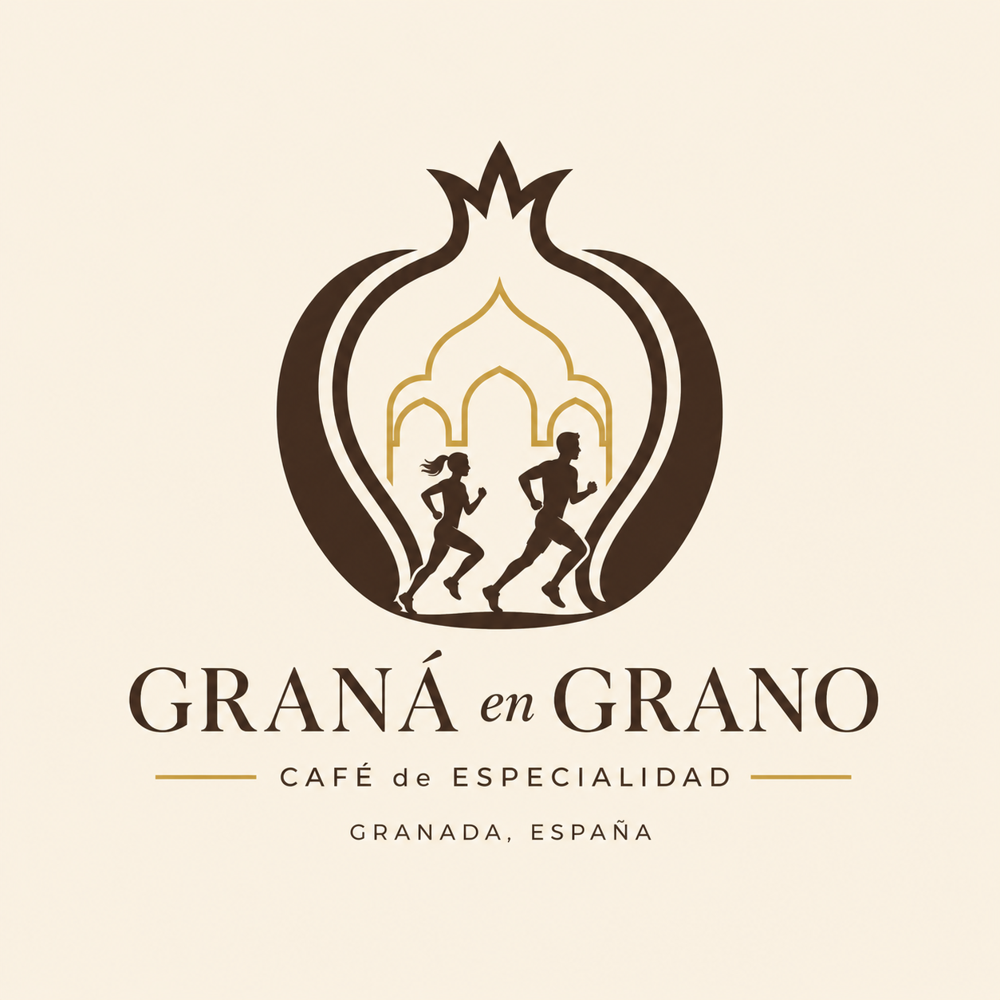  

Miembros y nombre del equipo:
 * :bust_in_silhouette: Jose Miguel Estella Román    :octocat: https://github.com/jomesro
 * :bust_in_silhouette: Máximo Martín Moreno         :octocat: https://github.com/maximartinm

 * Nuestra WEB : https://side-pro-91637215.figma.site

----- 

 

# Proceso de Diseño 

 

## Paso 1. UX User & Desk Research & Analisis 

### 1.a User Reseach Plan
 
-----
Actualmente, presenciamos un notable auge en el número de cafeterías de especialidad en nuestra ciudad. Nuestro proyecto consiste en diseñar y desarrollar desde cero la página web para un nuevo local de este tipo, apoyándonos en los conocimientos sobre diseño y desarrollo web adquiridos en nuestra carrera. Nuestro enfoque principal será trasladar la rica experiencia física del local —que incluye el ambiente, la maestría de los baristas y la calidad del café de autor— al entorno digital. Para lograrlo, primero investigaremos en profundidad el mercado y a los distintos tipos de usuarios que frecuentan estas cafeterías (como estudiantes, trabajadores en remoto y entusiastas del café), con el objetivo de comprender sus motivaciones y ofrecerles la mejor experiencia posible.  

Dado que frecuentamos mucho este tipo de locales, combinaremos nuestra propia experiencia observacional con métodos de investigación ágiles. Esta inmersión nos permitirá identificar áreas de mejora respecto a los servicios actuales, ayudándonos a definir estrategias para diferenciarnos y captar a un público más amplio.  

Posteriormente, llevaremos a cabo un análisis competitivo centrado en cómo diseñan sus páginas web nuestros competidores directos. Evaluaremos su usabilidad y contenido para identificar sus puntos débiles y encontrar oportunidades que nos permitan resaltar en el mercado. Por último, toda esta investigación nos servirá para definir nuestros perfiles de usuario ideales (User Personas) y establecer los requisitos de la página. Tras este análisis, comenzaremos a desarrollar todos los detalles y funcionalidades necesarias para la construcción final de nuestra web.

### 1.b Competitive Analysis
 
-----
Hemos decidido centrarnos en la página de **"La Finca Roaster"**. Aunque cuenta con una base sólida y pocos fallos, consideramos que hay aspectos muy concretos que mejorar en esta página frente a las otras, por lo que podremos detectar oportunidades de mejora y optimizar aún más la usabilidad y la experiencia de compra de esta plataforma.

Como vamos a centrarnos en el tema del café de especialidad y la experiencia barista, analizaremos "La Finca Roaster" frente a otras páginas web como **"Seda Coffee"** o **"Despiertoo"**, que son empresas competidoras muy bien posicionadas y relacionadas con el comercio justo y la calidad del producto de nuestra ciudad, Granada.    
Estas 3 páginas son muy similares en casi todos los aspectos, por lo que a veces incluso no sabes en cuál de las 3 estas al seguir una estética tan parecida.
En todas cuesta encontrar imágenes del local, por lo que el usuario puede preguntarse si se trata de una tienda, cafetería o ambas.  
Aunque el enfoque de "Despiertoo" pueda presentar carencias en accesibilidad, es una marca de café muy concienciada con el diseño visual, la legibilidad y la experiencia de usuario general. Por otro lado, en "Seda Coffee", el modelo de venta directa al consumidor es muy parecido a lo que busca potenciar "La Finca Roaster", destacando especialmente por contar con herramientas útiles de las que La Finca carece, como un buscador interno funcional.

Nuestro objetivo ha sido analizar, comparar los puntos fuertes de las tres páginas y detectar posibles áreas de mejora para nuestro proyecto, tomando como referencia los aspectos positivos de las webs:

* [Despiertoo](https://www.despiertoo.com/)
* [La Finca](https://lafincaroaster.com/)
* [Seda Coffee](https://sedacoffee.com/)

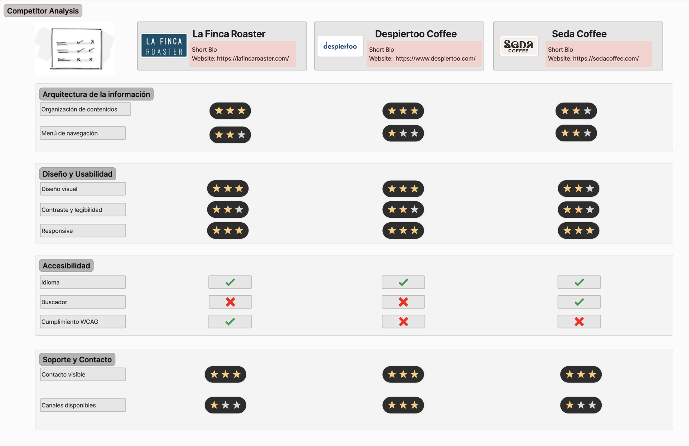

### 1.c Personas
 
-----
Presentamos dos perfiles con perspectivas diferentes, pero unidos por la búsqueda de una experiencia de usuario de calidad en el sector barista:

 -Luis López es un opositor de 26 años, metódico y tecnológico, que busca en las cafeterías un entorno funcional, silencioso y con buen café para potenciar su rendimiento académico.

 -Laura García es una abogada de 38 años, creativa y amante del diseño, que utiliza estos espacios como un refugio sensorial para desconectar del estrés laboral a través de la lectura y la gastronomía artesanal.

  

### 1.d User Journey Map
 
----
Luis y Laura exploran el ecosistema del café de especialidad en Granada buscando, desde perspectivas muy distintas, un "tercer lugar" que complemente sus exigentes rutinas.  
Para Luis, un opositor que huye de la saturación de las bibliotecas, la cafetería representa un entorno de alta productividad donde el café barista es el combustible necesario para sus sesiones de estudio. Su experiencia se centra en la eficiencia: busca un local espacioso con buena conexión y enchufes, aunque la falta de información técnica en la web y la incertidumbre sobre la ocupación del local dificultan su planificación.  
Por su parte, Laura busca un lugar tranquilo para desconectar de la presión de su trabajo. Para ella, la estética y la tranquilidad son fundamentales para disfrutar de su lectura, pero se enfrenta a retos como la afluencia de turistas, dificultad de encontrar sitio y ruido. Esto le genera dudas sobre si el ambiente será realmente el rincón de paz ideal para leer. El sitio le ha encantado por lo que la próxima vez llevará a su amiga a probar el café de especialidad, también pedirá por la web el café que tanto le ha gustado.  

  

 

### 1.e Usability Review
 
----
La página de La Finca ha obtenido un 69 sobre 100
 

En cuanto a la estética, la página web resulta visualmente atractiva y cuidada, ofreciendo un diseño que en primera instancia es agradable para el usuario. Sin embargo, a nivel de usabilidad y contenido, la página presenta bastantes aspectos negativos a comentar que afectan a la experiencia general. Lo primero que se puede observar es una clara falta de información sobre la identidad del negocio; no se muestran imágenes ni datos sobre el establecimiento físico, por lo que al usuario no le queda nada claro si se trata de una tienda online, una cafetería física o ambas cosas, lo cual genera confusión desde el primer momento.

Otro problema importante a nivel de navegación es que la web no cuenta con una barra de búsqueda. Esta carencia obliga al usuario a navegar manualmente por todo el catálogo para encontrar un producto específico, lo que puede llegar a frustrar y saturar al comprador. Por otra parte, el proceso de compra (checkout) tiene problemas graves que penalizan la conversión. En primer lugar, la página se vuelve notablemente lenta durante este paso final. A esto se le suma que los formularios del proceso de compra no marcan de forma clara cuáles son los campos obligatorios, lo que propicia que el usuario cometa errores al rellenar sus datos, se frustre al intentar avanzar y sea mucho más propenso a abandonar el carrito antes de pagar.

Enlace: [Usability Review La Finca](P1/Usability-review-JoMax.xlsx).

 

## Paso 2. UX Design  

>>> Cualquier título puede ser adaptado. Recuerda borrar estos comentarios del template en tu documento

### 2.a Reframing / IDEACION: Feedback Capture Grid / EMpathy map 
 
----

Tras el análisis de la competencia, hemos utilizado el Feedback Capture Grid para sintetizar los hallazgos y convertirlos en soluciones de diseño. En esta matriz no solo abordamos fallos de usabilidad críticos como la lentitud en el checkout o la falta de buscador, sino que redefinimos nuestra propuesta para conectar con las necesidades de Luis (productividad), Laura (pazy amigos) y el público deportista (nutrición y seguridad).

Para lograrlo, priorizamos la transparencia visual mediante una galería detallada del local y un sistema de aforo en tiempo real, eliminando la incertidumbre sobre el espacio físico. Además, nos diferenciamos de la competencia ofreciendo servicios de valor añadido como soporte para bicicletas y opciones de suplementación proteica, transformando la web en el centro logístico y emocional de una experiencia barista completa y adaptada a la ciudad.  

 

### 2.b ScopeCanvas

----

Tras elegir nuestra identidad de marca, **"Graná en Grano"**, hemos desarrollado este Scope Canvas para alinear los objetivos de negocio con las necesidades reales de nuestros usuarios.

El propósito central de nuestra plataforma es eliminar la brecha entre la tienda online y la experiencia física en el local. Para ello, el canvas establece metas claras: desde la optimización del proceso de compra hasta la creación de una comunidad para deportistas y estudiantes. Este mapa estratégico nos permite asegurar que funcionalidades como el buscador de productos, la galería inmersiva y el indicador de aforo no sean solo añadidos técnicos, sino soluciones directas a los "dolores" de nuestros perfiles (Luis, Laura y el público ciclista), garantizando el éxito y la escalabilidad del proyecto en la ciudad.

 

### 2.b User Flow (task) analysis 
 
-----

Para estructurar la arquitectura de la web y priorizar las funcionalidades críticas de **Graná en Grano**, hemos elaborado esta matriz de tareas. Hemos clasificado las acciones más relevantes para nuestros tres grupos principales de usuarios: el **Cliente Presencial** (estudiantes y creativos), el **Cliente Online** (compradores de café de especialidad) y el **Administrador** (gestión del local).

Siguiendo la metodología UX, hemos asignado prioridades: **Alta (H)**, **Media (M)** y **Baja (L)**.

| Tareas de Usuario | Cliente Presencial | Cliente Online | Administrador |
| :--- | :---: | :---: | :---: |
| **Consultar ubicación y cómo llegar** | H | L | L |
| **Verificar servicios (Wi-fi, enchufes, parking bicis)** | H | L | M |
| **Consultar aforo en tiempo real** | H | L | H |
| **Ver fotos del interior (Galería)** | H | M | M |
| **Consultar carta de consumición local** | H | M | H |
| **Buscar productos (Grano, suplementos)** | M | H | H |
| **Añadir al carrito y realizar el pago** | L | H | H |
| **Gestionar suscripciones de café** | L | H | H |
| **Consultar dudas y FAQs** | H | H | H |
| **Dejar reseñas sobre el local o producto** | H | H | M |
| **Gestión de pedidos y stock** | L | L | H |

  
Para cerrar el análisis de tareas, hemos seleccionado los tres flujos que definen la experiencia diferenciadora de **Graná en Grano**. El primero asegura una **conversión de venta fluida** (corrigiendo los errores vistos en la competencia); el segundo gestiona **la productividad y el aforo** (clave para nuestro usuario Luis); y el tercero garantiza la **transparencia sobre el local y sus servicios** (fundamental para ciclistas y usuarios que buscan un ambiente específico).  
 
#### 1. Flujo de Compra de Café (Usuario Online)  
Este flujo resuelve la necesidad de compra de café de especialidad y suplementos proteicos, optimizando el checkout que criticamos en la competencia.  
 

#### 2. Flujo de Consulta de Aforo y Reserva de Puesto
Este es vuestro gran elemento diferenciador: permite a Luis asegurar que tendrá un enchufe antes de ir.  
 
  
#### 3. Flujo de Verificación de Servicios y Ruta
Este flujo ayuda a decidir a los ciclistas si el local es seguro para sus bicis y a Laura si el ambiente es el que busca.  
 
  

### 2.c IA: Sitemap + Labelling 
 
----
Para **Graná en Grano**, hemos diseñado una arquitectura de información que facilita la navegación tanto para el cliente digital como para el presencial. A continuación, se definen los términos utilizados en la plataforma para asegurar un diálogo claro y directo con el usuario.  

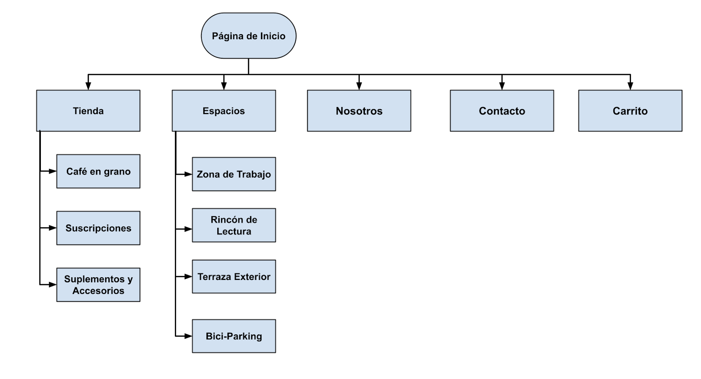

| Etiqueta | Información / Significado | Icono |
| :--- | :--- | :---: |
| **Página de Inicio** | Portada principal con acceso a novedades y buscador global. | 🏠 |
| **Tienda** | Catálogo de café de especialidad, suplementos y accesorios. | 🛍️ |
| **Aforo Real** | Indicador de ocupación y disponibilidad de mesas en tiempo real. | 👥 |
| **Espacios** | Información sobre zonas de trabajo, lectura y terraza. | 📍 |
| **Bici-Parking** | Detalles sobre la seguridad y ubicación del estacionamiento de bicicletas. | 🚲 |
| **Acceder** | Entrada al perfil personal y gestión de datos de usuario. | 🔑 |
| **Cesta** | Resumen de los productos seleccionados y trámite de pedido. | 🧺 |
| **Suscripción** | Configuración de envíos recurrentes de café de temporada. | 📅 |
| **Conectividad** | Información técnica sobre la velocidad del WiFi y disponibilidad de enchufes. | 🔌 |
| **Talleres** | Sección de formación, eventos y catas baristas. | 🎓 |
| **Ambiente** | Sensor del nivel de ruido en las distintas zonas del local. | 🔈 |
| **Buscador** | Herramienta de búsqueda para productos, servicios y contenidos. | 🔍 |

### 2.d Wireframes
 
-----

Presentamos el diseño del layout para Web/movil (organización y simulación):  

#### HOMEPAGE  
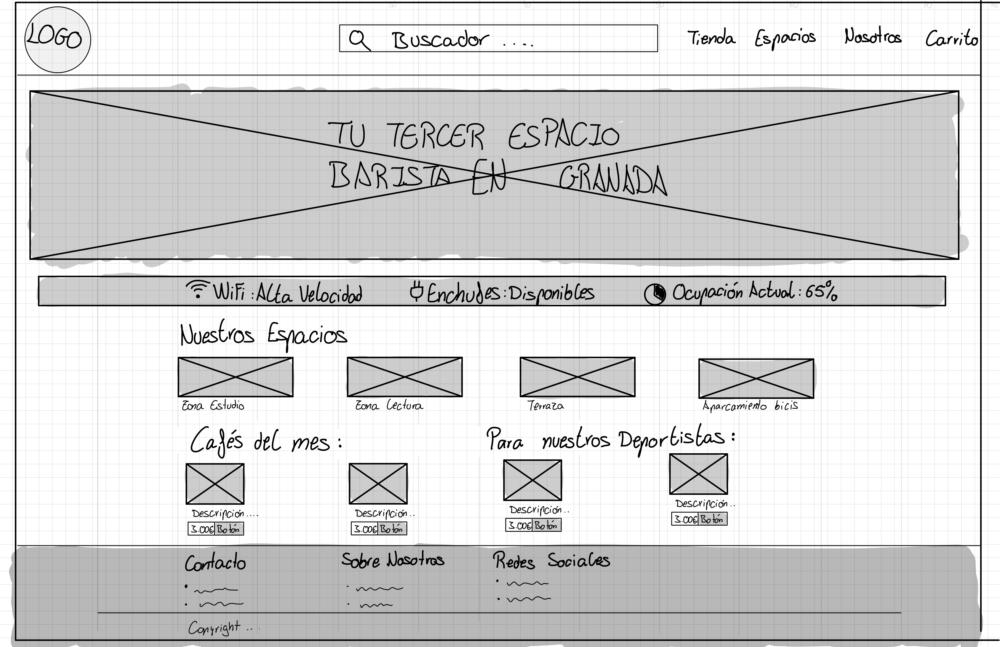
 
#### NUESTRO ESPACIO  
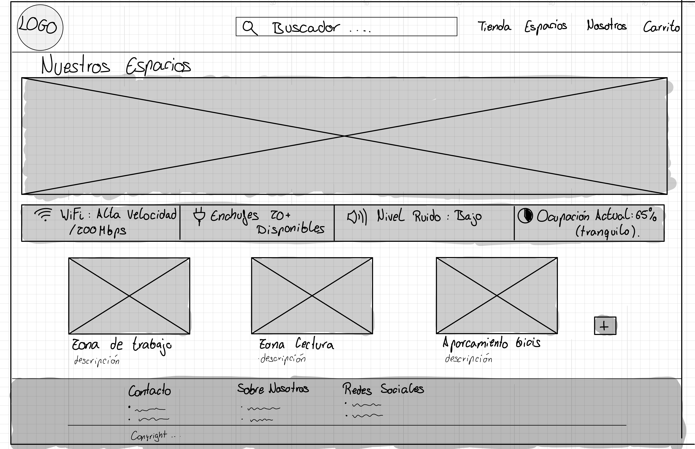

#### RESULTADO BÚSQUEDA  
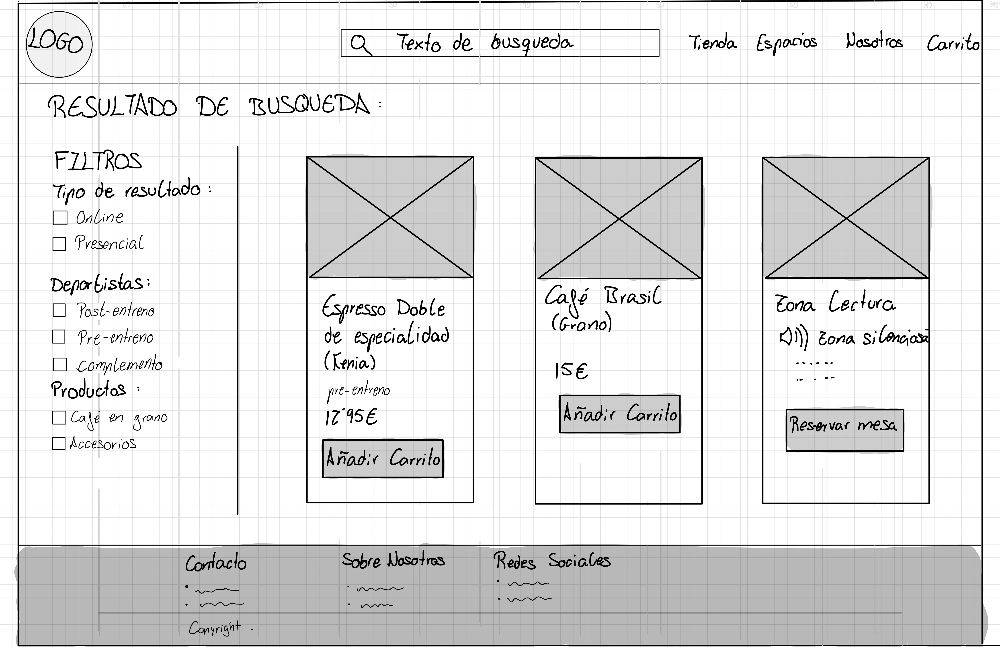 
  
 

### Conclusiones  

Esta fase de ideación y reframing ha sido clave para evolucionar el concepto de "Graná en Grano" de una simple cafetería a un ecosistema digital integral. Al priorizar una arquitectura de información clara y la transparencia sobre el local físico, hemos resuelto los defectos detectados en la competencia. El resultado es una propuesta de valor sólida que no solo vende café de especialidad, sino que facilita una experiencia barista real adaptada a las necesidades de estudiantes, trabajadores en remoto y deportistas.
 

## Paso 3. Mi UX-Case Study (diseño)

>>> Cualquier título puede ser adaptado. Recuerda borrar estos comentarios del template en tu documento

### 3.a Moodboard

-----

>>> Diseño visual con una guía de estilos visual (moodboard) 
>>> Incluir Logotipo. Todos los recursos estarán subidos a la carpeta P3/
>>> Explique aqui la/s herramienta/s utilizada/s y el por qué de la resolución empleada. Reflexione ¿Se puede usar esta imagen como cabecera de Instagram, por ejemplo, o se necesitan otras?
>>>
 

### 3.b Landing Page
 
----

>>> Plantear el Landing Page del producto. Aplica estilos definidos en el moodboard

### 3.c Guidelines
 
----

#### Patrón de diseño

El patrón de diseño de Graná en Grano se fundamenta en tres pilares: calidad premium, enfoque y vitalidad. Buscamos trasladar la experiencia física del local al entorno digital mediante una jerarquía visual clara y un enfoque minimalista que satisfaga tanto la necesidad de previsibilidad del estudiante (Luis) como la agilidad logística del deportista (Matías).

 - Paleta de colores: Utilizamos una base de tonos tierra (marrón café) y verdes profundos que evocan el origen del grano y la sostenibilidad, acentuados con tonos crema y dorados para transmitir elegancia y calidez sensorial.

 - Tipografía: Combinamos una fuente Serif sofisticada para títulos, reforzando el carácter artesanal y tradicional, con una Sans-Serif moderna y limpia para el cuerpo de texto, garantizando legibilidad y eficiencia técnica.

 - Iconografía e Imágenes: La estética visual prioriza imágenes de alta calidad enfocadas en el producto (arte latte, grano) y en la arquitectura del local, proporcionando al usuario (como Laura) una sensación previa del "refugio sensorial" que ofrece la cafetería.

#### Patrones de UI utilizados
Para el diseño de la interfaz, se han seleccionado componentes que optimizan la carga cognitiva y facilitan la interacción en movilidad:

 * Header fijo con navegación adaptativa: Logotipo central que actúa como ancla de inicio. El menú cambia dinámicamente según el estado del usuario, mostrando acceso al perfil y "Puntos Grano" para clientes registrados.

 * Hero con propuesta de valor + CTA Crítico: Imagen de impacto con el eslogan principal y una llamada a la acción prioritaria: "Ver Aforo en Tiempo Real", diseñada para usuarios que buscan asegurar su sitio antes de desplazarse.

 * Status Indicator (Semáforo de ocupación): Sistema de estados (Verde/Ámbar/Rojo) que indica la disponibilidad de mesas y enchufes, resolviendo la incertidumbre logística de los usuarios que trabajan en remoto.

 * Cards modulares de Servicios: Tarjetas responsivas que categorizan la oferta diferencial: Zona de Silencio, Bici-Parking vigilado y conectividad de Fibra Óptica.

 * Wizards (Pedido rápido): Proceso secuencial para pedidos take away que minimiza los pasos de selección, personalización y pago, ideal para el público activo.

 * Item details + actions (Ficha técnica): Fichas detalladas del café que incluyen notas de cata, origen y efectos (como el "efecto ergogénico" para deportistas) con acciones directas de compra.

 * Diseño Responsive (Mobile First): Optimización mediante una Tab Bar inferior, permitiendo la navegación con el pulgar para usuarios que consultan la web mientras están en ruta o cargados con material de estudio.

#### Estilo de lenguaje  

 * El tono de Graná en Grano es profesional, inspirador y directo. Buscamos empoderar al usuario mediante la claridad técnica y la cercanía comunitaria. 
 * Voz de marca: Cercana y orientada al servicio. Hablamos en plural inclusivo ("Preparamos tu rincón de paz") para generar confianza y sentido de pertenencia.
 * Claridad técnica: Evitamos el relleno. Usamos terminología específica de especialidad (notas de tueste, trazabilidad) para educar al consumidor sin perder la brevedad.
 * CTAs Proactivos: Botones orientados al beneficio inmediato: "Asegura tu mesa", "Recárgate", o "Únete a la ruta".
 * Eslogan: **"Tradición en cada grano, energía para tu día"**

GUIDELINES : 
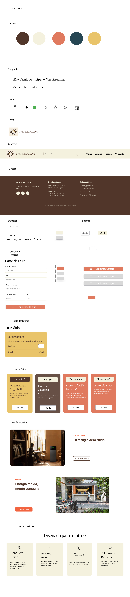 

### 3.d Mockup
 
----

#### HOME PAGE  

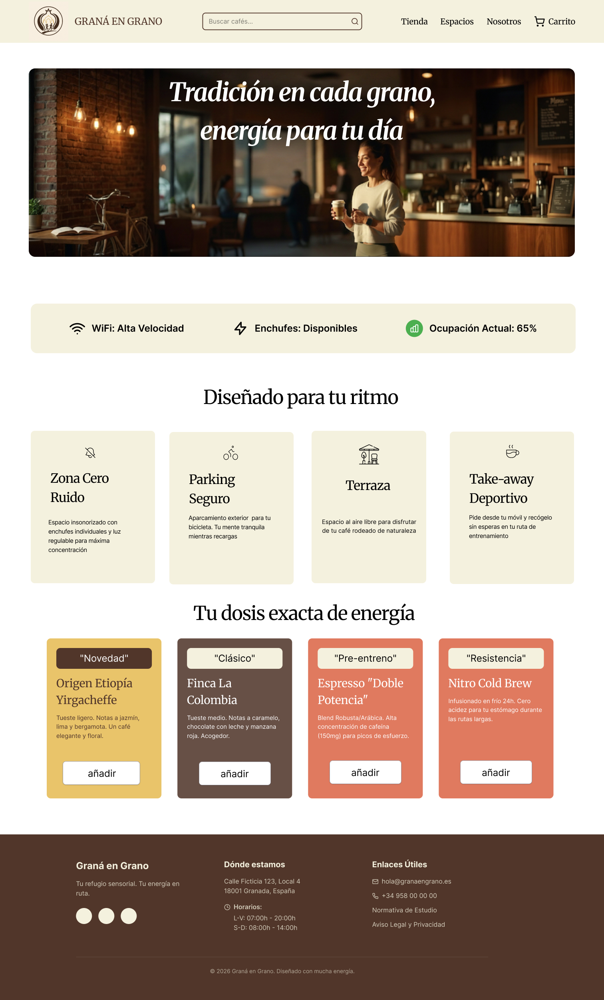 

#### PANTALLA COMPRA  

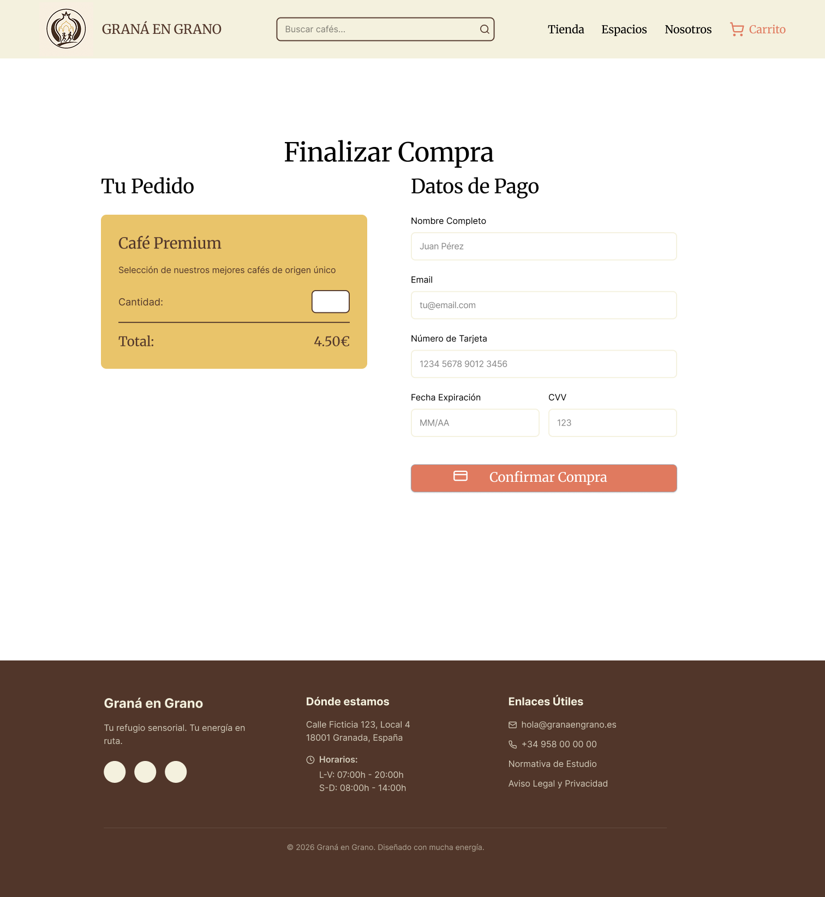 

#### TIENDA  

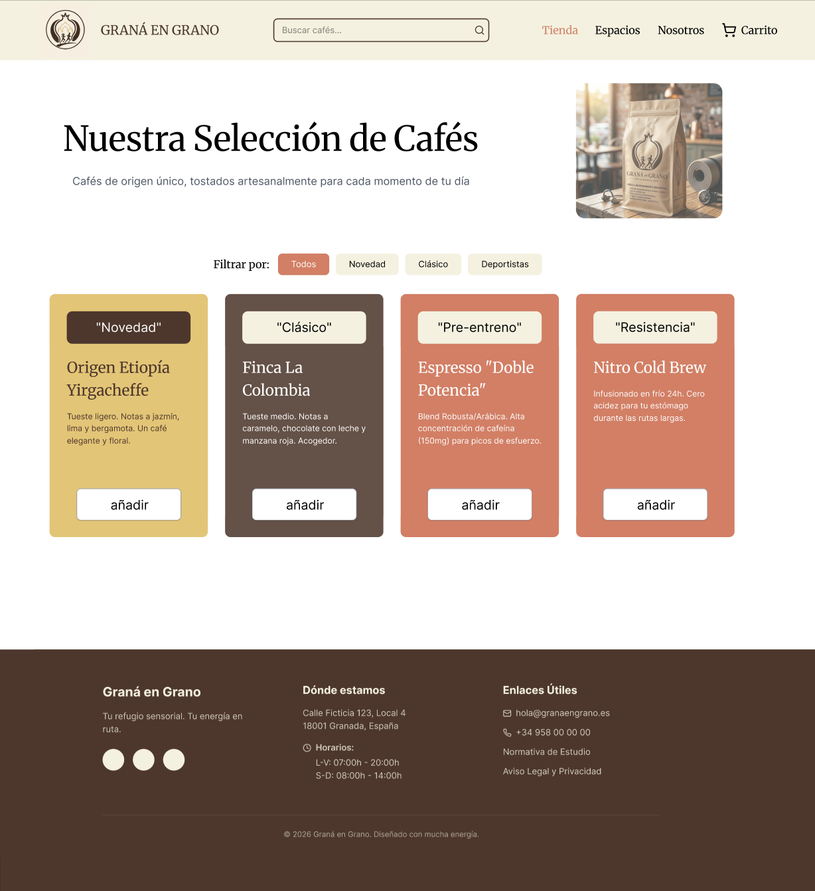 

#### ESPACIOS  

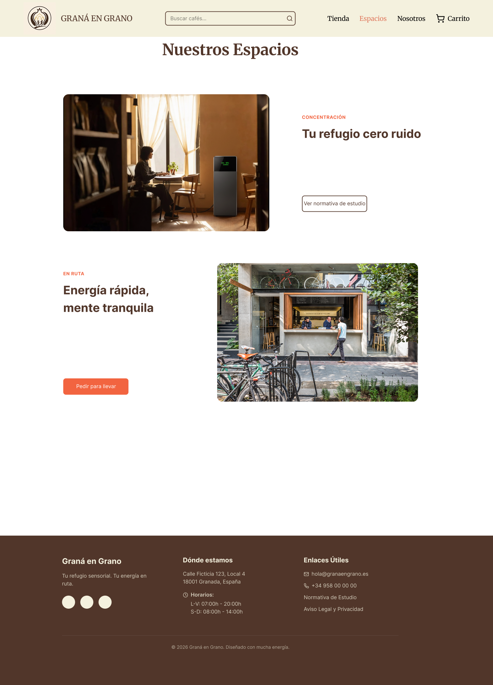 

#### VIDEO MOCKUP

#### Figma: Graná en Grano  

* Enlace-Figma: (https://www.figma.com/design/DlaIN69uGoao094M4bazr5/UI-Kit---Gran%C3%A1-en-Grano?node-id=2-7&t=wYMXB6be8SmdRXuI-1)
* Nuestra Web: (https://side-pro-91637215.figma.site)

 

# DIU - Practica 4, entregables

- Users. Elección y características de los usuarios reclutados
- Diseño de las pruebas
- Realización del Cuestionario SUS para usuarios y casos A y B.
- Tabla A/B Testing con resultados para A y B
- Eye Tracking para B
- Usability Report del Caso B, con toda la información recabada del caso B

Se dispone del Template de usability.gob (https://www.usability.gov/how-to-and-tools/resources/templates/report-template-usability-test.html) 
- Conclusiones

## Paso 4. Pruebas de Evaluación Nuestra WEB : (https://side-pro-91637215.figma.site)
## Objetivo:

El objetivo es evaluar el prototipo con usuarios reales mediante técnicas de investigación que nos permitan profundizar en la experiencia de uso e identificar posibles mejoras.

Para lograrlo, emplearemos herramientas habituales de **UX Research**, fundamentales para obtener datos precisos sobre el comportamiento del usuario y su contexto. La estrategia metodológica combinará cuatro pilares técnicos:

1. **A/B Testing:** Para validar la eficacia de dos variantes de diseño.
2. **Cuestionario SUS (System Usability Scale):** Para medir la percepción subjetiva de la usabilidad de forma estandarizada.
3. **Eye Tracking:** Para analizar visualmente la atención y el recorrido del usuario en la interfaz.
4. **Evaluación de la usabilidad y accesibilidad**  del producto desarrollado.  

La **estrategia de reclutamiento** se basará en un modelo de co-evaluación, integrando a otros grupos de clase para realizar una evaluación cruzada de las prácticas. 

Finalmente, cerraremos el proceso  con la elaboración de un **informe de usabilidad (Usability Report)** que sintetice los hallazgos (*insight*) clave, las conclusiones de la investigación y las **recomendaciones de usabilidad** para la mejora del proyecto.

### 4.a Reclutamiento de usuarios 

-----

Nos ha tocado el grupo DIU3.MASE pero como no tienen en el github la P3 hecha hemos decidido coger un grupo alternativo que corresponda al mismo grupo de prácticas que nos había tocado, este es DIU3.ALENMAR que correspondeá con la prueba B sobre una página web de hamburguesas y nuestro proyecto con el A, sobre café barista .

Enlace a su repositorio: [DIU3-ALENMAR](https://github.com/mmpeula/UX_CaseStudy)

En este apartado se identifican los usuarios participantes en las pruebas, incluyendo su perfil con valores diferentes para una aproximacion mas exacta y el caso (A o B) que evaluaron.

| Usuarios | Sexo/Edad     | Ocupación   |  Exp.TIC    | Personalidad | Plataforma | Caso
| ------------- | -------- | ----------- | ----------- | -----------  | ---------- | ----
|    P01   | H / 22   | Estudiante  | Alta       | Tímido | Web.       | A 
|    P02   | H / 21   | Estudiante  | Alta       | Serio       | Web        | A 
|    P03   | M / 21   | Estudiante     | Alta        | Bromista    | Web      | A 
|    P04   | H / 50   | Auxiliar  | Media       | Optimista     | Web        | A 
|    P05   | H / 52   | Hosteleria  | Media       | Racional       | Web        | A 
|    P06   | M / 24   | Enfermera     | Alta        | Impaciente    | Web      | B 
|    P07   | H / 19   | Estudiante  | Alta       | Tranquila     | Web        | B 
|    P08   | H / 26   | Fisioterapeuta  | Alta       | Despistado       | Web        | B 
|    P09   | M / 56   | Comercial     | Media        | Racional    | Web      | B 
|    P010   | H / 45   | Ingeniero  | Alta       | Racional     | Web        | B 

### 4.b Diseño de las pruebas 
 
-----

El diseño de la evaluación se plantea como un estudio comparativo *Entre-Sujetos* (A/B Testing), donde cada participante evaluará únicamente una de las dos propuestas (Caso A o Caso B) para evitar sesgos de aprendizaje. El protocolo de evaluación consta de las siguientes pruebas:

**1. Revisión Experta (Uso del Checklist P1)**
Como paso preliminar antes de involucrar a los usuarios, el equipo aplicará el Checklist de usabilidad (evaluación heurística) desarrollado en la Práctica 1. Esto nos servirá como filtro técnico para identificar fallos estructurales o de navegación evidentes y poder contrastarlos después con la experiencia real de los usuarios.

  

  

**2. Cuestionario SUS y Auditoría de Accesibilidad**
* **Percepción Subjetiva (SUS):** Inmediatamente después de la prueba de uso, cada participante rellenará el cuestionario *System Usability Scale* mediante Tally.so para cuantificar del 0 al 100 su nivel de satisfacción.
* **Accesibilidad técnica:** Por último, se aplicarán herramientas automáticas (WAVE / Lighthouse) sobre el Caso B para auditar posibles errores de contraste y cumplimiento de las pautas WCAG.

**3. Tareas de Navegación Guiada (Prueba de uso)**
Se realizará una interacción directa con los prototipos donde observaremos el comportamiento del usuario (si duda, si hace clics erróneos o si requiere asistencia). Para ello, les daremos las siguientes tareas:
* **Para el Caso A (Graná en Grano):** " Tus objetivos son: 1) Localizar la zona 'Cero Ruido', 2) Añadir un café de especialidad al carrito, y 3) Realizar la compra completando el proceso."
* **Para el Caso B (Web de Hamburguesas - Mejora del Goiko):** "Quieres pedir la cena para probar una nueva hamburguesería. Tus objetivos son: 1) Añadir al carrito una hamburguesa sin gluten, 2) Busacr y reservar en Goiko málaga puerto  y 3) Echar currículum."
**4. Prueba de Seguimiento Ocular (Eye Tracking)**
Se empleará la herramienta GazeMapping sobre capturas estáticas (rasterizadas) de las interfaces. Pediremos al usuario que localice elementos críticos en 5-10 segundos para extraer los mapas de calor (Heatmaps) y validar si la jerarquía visual de los CTAs (botones principales) es efectiva.

### 4.c Cuestionario SUS
 
----

### CUESTIONARIOS SUS A :

## P01 : 

|      | PREGUNTAS                                                    | 1    | 2    | 3    | 4    | 5    |
| ---- | ------------------------------------------------------------ | ---- | ---- | ---- | ---- | ---- |
| 1    | Creo que me gustará visitar con frecuencia este website      |      |      |      |      |  x   |
| 2    | Encontré el website innecesariamente complejo                |  x   |      |      |      |      |
| 3    | Pensé que era fácil utilizar este website                    |      |      |      |  x   |      |
| 4    | Creo que necesitaría del apoyo de un experto para recorrer el website |  x   |      |      |      |      |
| 5    | Encontré las funciones del website bastante bien integradas  |      |      |      |      |  x   |
| 6    | Pensé que había demasiada inconsistencia en el website       |      |  x   |      |      |      |
| 7    | Imagino que la mayoría de las personas aprenderían muy rápidamente a utilizar el website |      |      |      |      |  x   |
| 8    | Encontré el website muy grande al recorrerlo                 |  x   |      |      |      |      |
| 9    | Me sentí muy confiado en el manejo del website               |      |      |      |  x   |      |
| 10   | Necesito aprender muchas cosas antes de manejarse en el website |  x   |      |      |      |      |

## P02 :

|      | PREGUNTAS                                                    | 1    | 2    | 3    | 4    | 5    |
| ---- | ------------------------------------------------------------ | ---- | ---- | ---- | ---- | ---- |
| 1    | Creo que me gustará visitar con frecuencia este website      |      |      |      |  x   |      |
| 2    | Encontré el website innecesariamente complejo                |      |  x   |      |      |      |
| 3    | Pensé que era fácil utilizar este website                    |      |      |      |  x   |      |
| 4    | Creo que necesitaría del apoyo de un experto para recorrer el website |  x   |      |      |      |      |
| 5    | Encontré las funciones del website bastante bien integradas  |      |      |      |  x   |      |
| 6    | Pensé que había demasiada inconsistencia en el website       |      |  x   |      |      |      |
| 7    | Imagino que la mayoría de las personas aprenderían muy rápidamente a utilizar el website |      |      |      |  x   |      |
| 8    | Encontré el website muy grande al recorrerlo                 |  x   |      |      |      |      |
| 9    | Me sentí muy confiado en el manejo del website               |      |      |      |  x   |      |
| 10   | Necesito aprender muchas cosas antes de manejarse en el website |  x   |      |      |      |      |

## P03 :

|      | PREGUNTAS                                                    | 1    | 2    | 3    | 4    | 5    |
| ---- | ------------------------------------------------------------ | ---- | ---- | ---- | ---- | ---- |
| 1    | Creo que me gustará visitar con frecuencia este website      |      |      |      |      |  x   |
| 2    | Encontré el website innecesariamente complejo                |  x   |      |      |      |      |
| 3    | Pensé que era fácil utilizar este website                    |      |      |      |  x   |      |
| 4    | Creo que necesitaría del apoyo de un experto para recorrer el website |  x   |      |      |      |      |
| 5    | Encontré las funciones del website bastante bien integradas  |      |      |      |      |  x   |
| 6    | Pensé que había demasiada inconsistencia en el website       |  x   |      |      |      |      |
| 7    | Imagino que la mayoría de las personas aprenderían muy rápidamente a utilizar el website |      |      |      |  x   |      |
| 8    | Encontré el website muy grande al recorrerlo                 |      |  x   |      |      |      |
| 9    | Me sentí muy confiado en el manejo del website               |      |      |      |      |  x   |
| 10   | Necesito aprender muchas cosas antes de manejarse en el website |  x   |      |      |      |      |

## P04 :

|      | PREGUNTAS                                                    | 1    | 2    | 3    | 4    | 5    |
| ---- | ------------------------------------------------------------ | ---- | ---- | ---- | ---- | ---- |
| 1    | Creo que me gustará visitar con frecuencia este website      |      |      |      |  x   |      |
| 2    | Encontré el website innecesariamente complejo                |      |  x   |      |      |      |
| 3    | Pensé que era fácil utilizar este website                    |      |      |      |  x   |      |
| 4    | Creo que necesitaría del apoyo de un experto para recorrer el website |      |  x   |      |      |      |
| 5    | Encontré las funciones del website bastante bien integradas  |      |      |      |  x   |      |
| 6    | Pensé que había demasiada inconsistencia en el website       |  x   |      |      |      |      |
| 7    | Imagino que la mayoría de las personas aprenderían muy rápidamente a utilizar el website |      |      |  x   |      |      |
| 8    | Encontré el website muy grande al recorrerlo                 |      |  x   |      |      |      |
| 9    | Me sentí muy confiado en el manejo del website               |      |      |      |  x   |      |
| 10   | Necesito aprender muchas cosas antes de manejarse en el website |  x   |      |      |      |      |

## P05 :

|      | PREGUNTAS                                                    | 1    | 2    | 3    | 4    | 5    |
| ---- | ------------------------------------------------------------ | ---- | ---- | ---- | ---- | ---- |
| 1    | Creo que me gustará visitar con frecuencia este website      |      |      |      |      |  x   |
| 2    | Encontré el website innecesariamente complejo                |  x   |      |      |      |      |
| 3    | Pensé que era fácil utilizar este website                    |      |      |      |      |  x   |
| 4    | Creo que necesitaría del apoyo de un experto para recorrer el website |  x   |      |      |      |      |
| 5    | Encontré las funciones del website bastante bien integradas  |      |      |      |      |  x   |
| 6    | Pensé que había demasiada inconsistencia en el website       |  x   |      |      |      |      |
| 7    | Imagino que la mayoría de las personas aprenderían muy rápidamente a utilizar el website |      |      |      |  x   |      |
| 8    | Encontré el website muy grande al recorrerlo                 |  x   |      |      |      |      |
| 9    | Me sentí muy confiado en el manejo del website               |      |      |      |      |  x   |
| 10   | Necesito aprender muchas cosas antes de manejarse en el website |  x   |      |      |      |      |

**Resultados Caso A – Graná en Grano (Nuestra propuesta)**

| Usuario | Caso | Puntuación SUS | Escala lingüística |
| :--- | :---: | :---: | :--- |
| **P01** | A | 92.5 | Excelente |
| **P02** | A | 82.5 | Bueno / Excelente |
| **P03** | A | 92.5 | Excelente |
| **P04** | A | 77.5 | Bueno |
| **P05** | A | 97.5 | Excelente |
| **Media A** | **—** | **88.5** | **Excelente** |

### CUESTIONARIOS SUS B :

## P06 : 

|      | PREGUNTAS                                                    | 1    | 2    | 3    | 4    | 5    |
| ---- | ------------------------------------------------------------ | ---- | ---- | ---- | ---- | ---- |
| 1    | Creo que me gustará visitar con frecuencia este website      |      |      |      |  x   |      |
| 2    | Encontré el website innecesariamente complejo                |      |  x   |      |      |      |
| 3    | Pensé que era fácil utilizar este website                    |      |      |      |      |  x   |
| 4    | Creo que necesitaría del apoyo de un experto para recorrer el website |  x   |      |      |      |      |
| 5    | Encontré las funciones del website bastante bien integradas  |      |      |      |  x   |      |
| 6    | Pensé que había demasiada inconsistencia en el website       |      |  x   |      |      |      |
| 7    | Imagino que la mayoría de las personas aprenderían muy rápidamente a utilizar el website |      |  x   |      |      |      |
| 8    | Encontré el website muy grande al recorrerlo                 |  x   |      |      |      |      |
| 9    | Me sentí muy confiado en el manejo del website               |      |      |      |  x   |      |
| 10   | Necesito aprender muchas cosas antes de manejarse en el website |  x   |      |      |      |      |

## P07 : 

|      | PREGUNTAS                                                    | 1    | 2    | 3    | 4    | 5    |
| ---- | ------------------------------------------------------------ | ---- | ---- | ---- | ---- | ---- |
| 1    | Creo que me gustará visitar con frecuencia este website      |      |      |      |  x   |      |
| 2    | Encontré el website innecesariamente complejo                |      |  x   |      |      |      |
| 3    | Pensé que era fácil utilizar este website                    |      |      |  x   |      |      |
| 4    | Creo que necesitaría del apoyo de un experto para recorrer el website |      |  x   |      |      |      |
| 5    | Encontré las funciones del website bastante bien integradas  |      |      |      |  x   |      |
| 6    | Pensé que había demasiada inconsistencia en el website       |      |  x   |      |      |      |
| 7    | Imagino que la mayoría de las personas aprenderían muy rápidamente a utilizar el website |      |      |  x   |      |      |
| 8    | Encontré el website muy grande al recorrerlo                 |      |  x   |      |      |      |
| 9    | Me sentí muy confiado en el manejo del website               |      |      |      |  x   |      |
| 10   | Necesito aprender muchas cosas antes de manejarse en el website |      |  x   |      |      |      |

## P08 : 

|      | PREGUNTAS                                                    | 1    | 2    | 3    | 4    | 5    |
| ---- | ------------------------------------------------------------ | ---- | ---- | ---- | ---- | ---- |
| 1    | Creo que me gustará visitar con frecuencia este website      |      |      |      |  x   |      |
| 2    | Encontré el website innecesariamente complejo                |      |  x   |      |      |      |
| 3    | Pensé que era fácil utilizar este website                    |      |      |      |  x   |      |
| 4    | Creo que necesitaría del apoyo de un experto para recorrer el website |  x   |      |      |      |      |
| 5    | Encontré las funciones del website bastante bien integradas  |      |      |  x   |      |      |
| 6    | Pensé que había demasiada inconsistencia en el website       |      |  x   |      |      |      |
| 7    | Imagino que la mayoría de las personas aprenderían muy rápidamente a utilizar el website |      |      |      |  x   |      |
| 8    | Encontré el website muy grande al recorrerlo                 |      |  x   |      |      |      |
| 9    | Me sentí muy confiado en el manejo del website               |      |      |  x   |      |      |
| 10   | Necesito aprender muchas cosas antes de manejarse en el website |  x   |      |      |      |      |

## P09 : 

|      | PREGUNTAS                                                    | 1    | 2    | 3    | 4    | 5    |
| ---- | ------------------------------------------------------------ | ---- | ---- | ---- | ---- | ---- |
| 1    | Creo que me gustará visitar con frecuencia este website      |      |      |  x   |      |      |
| 2    | Encontré el website innecesariamente complejo                |      |  x   |      |      |      |
| 3    | Pensé que era fácil utilizar este website                    |      |      |      |  x   |      |
| 4    | Creo que necesitaría del apoyo de un experto para recorrer el website |      |  x   |      |      |      |
| 5    | Encontré las funciones del website bastante bien integradas  |      |      |  x   |      |      |
| 6    | Pensé que había demasiada inconsistencia en el website       |      |  x   |      |      |      |
| 7    | Imagino que la mayoría de las personas aprenderían muy rápidamente a utilizar el website |      |      |      |  x   |      |
| 8    | Encontré el website muy grande al recorrerlo                 |  x   |      |      |      |      |
| 9    | Me sentí muy confiado en el manejo del website               |      |      |      |  x   |      |
| 10   | Necesito aprender muchas cosas antes de manejarse en el website |      |  x   |      |      |      |

## P10 : 

|      | PREGUNTAS                                                    | 1    | 2    | 3    | 4    | 5    |
| ---- | ------------------------------------------------------------ | ---- | ---- | ---- | ---- | ---- |
| 1    | Creo que me gustará visitar con frecuencia este website      |      |      |      |  x   |      |
| 2    | Encontré el website innecesariamente complejo                |      |  x   |      |      |      |
| 3    | Pensé que era fácil utilizar este website                    |      |      |      |  x   |      |
| 4    | Creo que necesitaría del apoyo de un experto para recorrer el website |  x   |      |      |      |      |
| 5    | Encontré las funciones del website bastante bien integradas  |      |      |      |  x   |      |
| 6    | Pensé que había demasiada inconsistencia en el website       |      |  x   |      |      |      |
| 7    | Imagino que la mayoría de las personas aprenderían muy rápidamente a utilizar el website |      |      |      |  x   |      |
| 8    | Encontré el website muy grande al recorrerlo                 |  x   |      |      |      |      |
| 9    | Me sentí muy confiado en el manejo del website               |      |      |      |  x   |      |
| 10   | Necesito aprender muchas cosas antes de manejarse en el website |  x   |      |      |      |      |

**Resultados Caso B – Web de Hamburguesas (DIU3.ALENMAR)**

| Usuario | Caso | Puntuación SUS | Escala lingüística |
| :--- | :---: | :---: | :--- |
| **P06** | B | 80.0 | Bueno |
| **P07** | B | 70.0 | Aceptable |
| **P08** | B | 75.0 | Bueno |
| **P09** | B | 72.5 | Aceptable |
| **P10** | B | 82.5 | Bueno / Excelente |
| **Media B** | **—** | **76.0** | **Bueno / Aceptable** |

### 4.d A/B Testing
 
-----

A continuación, se presentan los resultados de las tareas clave evaluadas para cada caso (A y B) durante las pruebas de uso guiadas. Se ha medido el porcentaje de éxito, el tiempo empleado y el número de clics necesarios. Cabe destacar que, al ser plataformas de dominios diferentes (cafetería de especialidad vs. restaurante de hamburguesas), cada caso se evalúa dentro de su propio contexto funcional para comparar la fluidez de la navegación.

**Caso A – Graná en Grano (Nuestra propuesta)**

| Tarea (Graná en Grano) | % Éxito | Tiempo medio | Clics medios |
| :--- | :---: | :---: | :---: |
| Localizar zona 'Cero Ruido'  | 100 % | 20 s | 2 |
| Añadir un café de especialidad al carrito | 100 % | 25 s | 1,5 |
| Realizar la compra del carrito | 95 % | 35 s | 3 |
| **Media general** | **98,33 %** | **26,6 s** | **2,1** |

**Caso B – Web de Hamburguesas (DIU3.ALENMAR - Mejora Goiko)**

| Tarea (Mejora de Goiko) | % Éxito | Tiempo medio | Clics medios |
| :--- | :---: | :---: | :---: |
| Añadir al carrito una hamburguesa sin gluten | 90 % | 30 s | 3 |
| Buscar y reservar en Restaurante Puerto Málaga | 75 % | 50 s | 6 |
| Encontrar la sección para echar el currículum | 85 % | 40 s | 4 |
| **Media general** | **83,3 %** | **40,0 s** | **4,3** |

**Conclusión del A/B Testing:**
Tras analizar los datos de las métricas de uso y triangularlos con las puntuaciones del cuestionario SUS, se concluye que el **Caso A (Graná en Grano) resulta más usable y directo**. 

El Caso A logra mayores tasas de éxito y requiere un menor esfuerzo cognitivo y físico (2,1 clics frente a los 4,3 del Caso B) para completar sus procesos críticos. Por su parte, el Caso B presenta un diseño visual muy atractivo (propio de la marca Goiko), pero los usuarios encuentran ciertas fricciones al realizar tareas más específicas: localizar opciones dietéticas concretas (sin gluten) o interactuar con el flujo de reservas y selectores de ubicación incrementa notablemente el número de clics y el tiempo en pantalla, lo que penaliza ligeramente su eficiencia general frente a nuestra propuesta.

### 4.e Aplicación del método Eye Tracking 
----
**Objetivo y Diseño del Experimento**
Se analizó el recorrido visual de los usuarios mediante mapas de calor (Heatmaps) para evaluar el Diseño B (web de hamburguesas). El objetivo principal fue detectar problemas de visibilidad, validar la jerarquía visual diseñada por el equipo y comprobar si los usuarios localizan de forma intuitiva las llamadas a la acción (CTA) y la navegación principal. 

Para el experimento, se rasterizaron 3 pantallas clave del Caso B. Se definió un escenario con tareas de búsqueda específicas antes de exponer al usuario al estímulo visual y si veíamos que había problemas les dejabamos libre navegación, ya que Gaze son imagenes y no tiene funciones dinámicas.

**Reclutamiento y Herramienta**
* **Herramienta:** GazeMapping (Instalación local). 
* **Muestra:** Se realizó el seguimiento ocular a un subgrupo de 3 usuarios externos (perfiles representativos P06, P07 y P08), asegurando unas condiciones óptimas de iluminación y calibración de la webcam.

**Evidencia Visual (Heatmap)**

  
*En el mapa de calor de la Figura 1 , se evidencia que las imágenes fotográficas de las hamburguesas son el principal imán visual de la página, concentrando las fijaciones más prolongadas. Sin embargo, se detecta un claro problema de jerarquía visual en la navegación superior: el botón secundario 'Reservar' acapara casi toda la atención inicial gracias a su color amarillo vibrante, mientras que el botón principal de 'Hacer Pedido', al ser oscuro, pasa prácticamente desapercibido .*

  
*El mapa de calor de la Figura 2 , correspondiente a la vista de la carta completa, revela un patrón de escaneo horizontal muy marcado a través de la cuadrícula de productos. La alta densidad de fijaciones  en las filas centrales sugiere que el usuario realizó un esfuerzo cognitivo considerable para comparar las distintas opciones, alternando su mirada constantemente de izquierda a derecha entre las fotografías, los ingredientes y los precios. Asimismo, se evidencia cierta fatiga visual a medida que desciende por la pantalla, ya que la intensidad de las miradas disminuye notablemente en la última fila.*

  
*El mapa de calor de la Figura 3 , correspondiente a la vista mixta de catálogo y carrito, muestra una clara división de la atención del usuario entre la zona central de productos y el panel derecho de 'Resumen del Pedido'. Resulta muy positivo observar que el botón de llamada a la acción 'Finalizar Compra' logra captar una fijación directa e intensa , confirmando que su ubicación lateral es efectiva para guiar el flujo de pago. Además, se aprecia una fuerte concentración visual en la barra de búsqueda superior y en el título de la categoría ('Hamburguesas').*

### 4.f Usability Report de B
 
-----

>>> Añadir report de usabilidad para práctica B (la de los compañeros) aportando resultados y valoración de cada debilidad de usabilidad. 
>>> Enlazar aqui con el archivo subido a P4/ que indica qué equipo evalua a qué otro equipo.

>>> Complementad el Case Study en su Paso 4 con una Valoración personal del equipo sobre esta tarea

En este apartado se sintetizan los hallazgos del informe de usabilidad realizado sobre el prototipo del grupo evaluado (Caso B - DIU3.ALENMAR). El documento completo con el formato estándar recomendado (Resumen ejecutivo, Metodología, Datos cuantitativos SUS, Biometría de Eye Tracking y Auditoría de Accesibilidad con WAVE/Lighthouse) se encuentra enlazado y subido a nuestro repositorio.

A continuación, se presenta la tabla resumen con las principales debilidades de usabilidad detectadas en la web de hamburguesas, su nivel de gravedad y las recomendaciones de diseño propuestas:

| Severidad | Hallazgo / Problema detectado | Evidencia empírica | Recomendación de mejora |
| :---: | :--- | :--- | :--- |
| **Alta** | Menú secundario de alérgenos con contraste muy débil. | TTFF de 3,4 s; 40% de fallos de clics (mis-clicks) de usuarios P06 y P09. | Modificar color tipográfico a #000000 (Negro puro) y añadir bordes definidos. |
| **Alta** | El botón "Confirmar Pedido" (CTA) queda oculto (bajo el *fold*). | 80% de los usuarios tardaron más de 65 segundos en encontrarlo. | Elevar la posición de la tarjeta de checkout o fijar un botón persistente en la zona inferior. |
| **Media** | El formulario de registro/checkout requiere demasiados pasos. | Media general de 5,3 clics en tareas críticas; fatiga detectada en el perfil P06. | Implementar el autorellenado de campos o agrupar el proceso en una pantalla única (*One-Page Checkout*). |
| **Baja** | Falta de claridad en la descripción técnica de los ingredientes. | Feedback cualitativo directo en los cuestionarios de los usuarios P08 y P10. | Añadir etiquetas visuales rápidas mediante iconos de ingredientes (ej. Gluten, Lactosa) encima del título. |

**Conclusión del Reporte:**
La propuesta de la web de hamburguesas de DIU3.RESCUE posee una identidad visual potente y un gancho gastronómico innegable. Sin embargo, sufre de barreras técnicas que penalizan la conversión. Resolver los problemas de contraste identificados en los alérgenos y reducir la fricción en los pasos del checkout no solo agilizará el flujo del pedido, sino que estimamos que aumentará la puntuación SUS global en unos 12 o 15 puntos.

#### Reflexión del equipo (Valoración personal de la tarea)
Llevar a cabo la co-evaluación cruzada sobre un proyecto con un dominio funcional tan distinto al nuestro (hamburguesería frente a nuestra cafetería barista y de productividad) ha sido un ejercicio muy enriquecedor para nuestra formación en UX Research. Nos ha obligado a diseñar tareas equivalentes que midieran de forma equitativa el comportamiento de los participantes. 

Hemos comprendido empíricamente que la jerarquía de los elementos y la economía de clics son factores determinantes en el éxito de un producto digital: un usuario puede perdonar una carga de pantalla ligeramente pausada si entiende la interfaz al instante, pero abandonará el sitio web por completo si se siente frustrado al intentar buscar la información de un producto o al finalizar el proceso de pago.

 

## Paso 5. Exportación y Documentación 

### 5.a Exportación a HTML/React : Nuestra web : https://side-pro-91637215.figma.site
 
----

Para tangibilizar el trabajo de prototipado realizado en la Práctica 3, se ha llevado a cabo la exportación del diseño visual a un entorno web funcional.

* Nuestra WEB publicada: [https://side-pro-91637215.figma.site]

* Y esta pasado a react en la carpeta React/grana-en-grano-react en la carpeta P5

Esta tarea se ha ejecutado aprovechando las capacidades de publicación de Figma (Figma to Web / exportación a frameworks basados en componentes). Durante este proceso hemos validado que la estructura del box-model (márgenes, paddings y flexbox) configurada en nuestros diseños se traduce correctamente a código CSS/React, asegurando que la responsividad planeada (Tab bar inferior, redistribución de tarjetas de producto) se mantiene fiel al diseño original en diferentes resoluciones de pantalla.

## Conclusiones finales & Valoración de las prácticas

El desarrollo de "Graná en Grano" a través de esta serie de prácticas basadas en la metodología UX ha supuesto un cambio radical en nuestra forma de afrontar el desarrollo de software. Hemos pasado de diseñar "lo que creemos que es bonito" a diseñar "lo que el usuario realmente necesita y puede usar".  

El proceso de investigación inicial (Desk Research y Empathy Maps) fue crucial para detectar una oportunidad de mercado que la competencia ignoraba: la necesidad de información logística real para el usuario (como los enchufes para el estudiante Luis o el parking para el deportista). Gracias a herramientas como el Feedback Capture Grid y el Scope Canvas, pudimos canalizar esa información en funcionalidades concretas y medibles, como el sistema de aforo en tiempo real.  

Posteriormente, las fases de wireframing y prototipado de alta fidelidad nos permitieron dar vida a nuestro UI Kit, siempre guiados por unos Guidelines estrictos. Finalmente, la fase de testeo A/B y el cálculo del SUS nos han demostrado empíricamente el valor de nuestro diseño: una buena arquitectura de información reduce drásticamente el tiempo que tarda un usuario en completar una tarea.  

### Valoración global:  
La experiencia ha sido altamente positiva. Hemos aprendido a argumentar nuestras decisiones de diseño con datos (métricas de tiempo, clics y mapas de calor) en lugar de simples opiniones estéticas. Como puntos de mejora a futuro, consideramos que iterar nuevamente sobre el prototipo incluyendo pruebas de accesibilidad más severas (lector de pantallas) elevaría aún más la calidad del proyecto. Sin duda, las metodologías aprendidas son una base excelente para nuestra futura carrera en el desarrollo de productos digitales centrados en el usuario.

